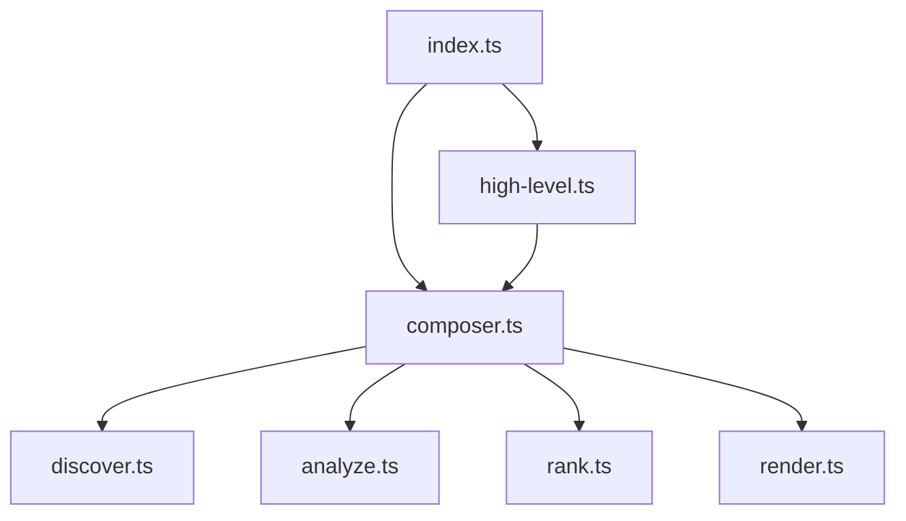

<div align="center">


# RepoGraph

### Your Codebase, Visualized & Understood.

**Generate rich, semantic, and interactive codemaps to navigate, analyze, and master any repository.**

[](https://www.npmjs.com/package/repograph)
[](./LICENSE)
[](https://github.com/relaycoder/repograph/actions)
[](http://makeapullrequest.com)

</div>

---

Ever felt lost in a new codebase? Struggled to see the big picture or find the most critical files? RepoGraph is your solution. It's a powerful command-line tool and library that analyzes your code, builds a dependency graph, ranks key files and symbols, and generates a beautiful, detailed Markdown report.

Whether you're onboarding new engineers, planning a large-scale refactor, or even providing context to an AI, RepoGraph gives you the map you need to navigate with confidence.

## ✨ Key Features & Benefits

| Feature                               | Benefit                                                                                                                                                    |
| :------------------------------------ | :--------------------------------------------------------------------------------------------------------------------------------------------------------- |
| **🧠 Multi-Language Semantic Analysis** | Uses **Tree-sitter** to parse your code with deep understanding, identifying not just files, but classes, functions, methods, and their relationships.     |
| **⚡ Parallel Processing**              | Leverages **worker threads** to analyze files in parallel, dramatically speeding up analysis for large codebases with configurable worker pools.        |
| **⭐ Intelligent Ranking Algorithms**   | Go beyond file names. Rank code by importance using **PageRank** (centrality) or **Git Hot-Spots** (change frequency) to immediately find what matters.       |
| **🎯 Rich Symbol Qualifiers**           | Extract deep metadata including visibility (`public`/`private`), `async`/`static` status, purity, exception handling, parameter types, and return types. |
| **🎨 Comprehensive Markdown Reports**  | Generates a `repograph.md` file with a project overview, dependency graphs, ranked file lists, and detailed symbol breakdowns.                              |
| **📊 Automatic Mermaid.js Graphs**     | Visualize your module dependencies with an automatically generated, easy-to-read Mermaid diagram right in your report.                                       |
| **🧩 Composable Pipeline API**         | A fully functional, composable API allows you to replace or extend any part of the pipeline: **Discover → Analyze → Rank → Render**.                         |
| **⚙️ Highly Configurable CLI**          | Fine-tune your analysis and output with a rich set of command-line flags to include/ignore files, customize the report, and more.                            |

## 🚀 Why Use RepoGraph?

-   **Accelerate Onboarding:** Give new developers a guided tour of the codebase, highlighting the most important entry points and modules.
-   **Master Code Navigation:** Understand how components are interconnected, making it easier to trace logic and predict the impact of changes.
-   **Prioritize Refactoring:** Identify highly-central but frequently changed files—prime candidates for refactoring and stabilization.
-   **Enhance AI Context:** Feed a structured, ranked, and semantically-rich overview of your codebase to LLMs for vastly improved code generation, analysis, and Q&A.
-   **Power Advanced Tooling:** The rich, structured data output is a perfect foundation for sophisticated tools like `scn-ts` to generate specialized visualizations and representations.
-   **Streamline Architectural Reviews:** Get a high-level, data-driven view of your system's architecture to facilitate design discussions.

## 📸 Gallery: Example Output

Imagine running `repograph` on a small project. Here's a glimpse of the beautiful and insightful Markdown file it produces.

---

# RepoGraph

_Generated by RepoGraph on 2025-07-20T06:21:00.000Z_

## 🚀 Project Overview

This repository contains 25 nodes (5 files).

### Module Dependency Graph



### Top 5 Most Important Files

| Rank | File                      | Description                       |
| :--- | :------------------------ | :-------------------------------- |
| 1    | `src/pipeline/analyze.ts` | Key module in the architecture.   |
| 2    | `src/index.ts`            | Key module in the architecture.   |
| 3    | `src/composer.ts`         | Key module in the architecture.   |
| 4    | `src/types.ts`            | Key module in the architecture.   |
| 5    | `src/pipeline/render.ts`  | Key module in the architecture.   |

---

## 📂 File & Symbol Breakdown

### [`src/pipeline/analyze.ts`](./src/pipeline/analyze.ts)

-   **`function createTreeSitterAnalyzer`** - _L257_
    ```typescript
    export const createTreeSitterAnalyzer = (): Analyzer => {
    ```
-   **`function processFileDefinitions`** (throws) - _L291_
    ```typescript
    function processFileDefinitions(
    ```
-   **`function findEnclosingSymbolId`** (calls `parent`) - _L461_
    ```typescript
    function findEnclosingSymbolId(startNode: TSNode, file: FileContent, nodes: ReadonlyMap<string, CodeNode>): string | null {
    ```

---

## 🔬 Rich Semantic Analysis

RepoGraph extracts deep semantic details from your code, making it perfect for integration with advanced analysis and AI tools.

### Symbol Qualifiers Extracted

-   **Visibility:** `public`, `private`, `protected`, `internal`, `default`
-   **Modifiers:** `async`, `static`
-   **Behavior:** `canThrow` (detects exceptions), `isPure` (detects side-effect-free functions)
-   **Type System:** Parameter names and types, return types

### Example: TypeScript Analysis

Given this code:

```typescript
export class UserService {
  public async getUser(id: string): Promise<User> {
    if (!id) throw new Error('ID is required');
    return await this.repository.findById(id);
  }

  private static validateEmail(email: string): boolean {
    return email.includes('@');
  }
}
```

RepoGraph produces a `CodeNode` with this structured metadata:

-   `getUser`: `visibility: 'public'`, `isAsync: true`, `canThrow: true`, `returnType: 'Promise<User>'`, `parameters: [{ name: 'id', type: 'string' }]`
-   `validateEmail`: `visibility: 'private'`, `isStatic: true`, `returnType: 'boolean'`, `parameters: [{ name: 'email', type: 'string' }]`

This rich metadata enables sophisticated integrations with tools like **`scn-ts`** for enhanced code visualization and AI-powered analysis.

## 📦 Installation

Install RepoGraph globally to use it as a CLI tool from anywhere on your system.

```bash
# Using npm
npm install -g repograph

# Using yarn
yarn global add repograph

# Using pnpm
pnpm add -g repograph
```

## 🛠️ Usage

### Command-Line Interface (CLI)

The CLI is the quickest way to get a codemap. Simply navigate to your project's root directory and run the command.

**Basic Usage**

```bash
# Analyze the current directory and create repograph.md
repograph
```

**Advanced Usage**

```bash
# Analyze a specific project, use the git-changes ranker, and customize the output
repograph ./my-cool-project \
  --output docs/CodeMap.md \
  --ranking-strategy git-changes \
  --ignore "**/__tests__/**" \
  --max-workers 4 \
  --no-mermaid
```

#### All CLI Options

| Argument                      | Alias | Description                                                     | Default          |
| :---------------------------- | :---- | :-------------------------------------------------------------- | :--------------- |
| `root`                        |       | The root directory of the repository to analyze.                | `.`              |
| `--output <path>`             |       | Path to the output Markdown file.                               | `repograph.md`   |
| `--include <pattern>`         |       | Glob pattern for files to include. Can be specified multiple times. | `**/*`           |
| `--ignore <pattern>`          |       | Glob pattern for files to ignore. Can be specified multiple times. |                  |
| `--no-gitignore`              |       | Do not respect `.gitignore` files.                              | `false`          |
| `--ranking-strategy <name>`   |       | Ranking strategy: `pagerank` or `git-changes`.                  | `pagerank`       |
| `--max-workers <num>`         |       | Number of parallel workers for analysis. Set to 1 for single-threaded. | `1`              |
| `--log-level <level>`         |       | Logging level: `silent`, `error`, `warn`, `info`, `debug`.      | `info`           |
| `--help`                      | `-h`  | Display the help message.                                       |                  |
| `--version`                   | `-v`  | Display the version number.                                     |                  |
| **Output Formatting**         |       |                                                                 |                  |
| `--no-header`                 |       | Do not include the main "RepoGraph" header.                     | `false`          |
| `--no-overview`               |       | Do not include the project overview section.                    | `false`          |
| `--no-mermaid`                |       | Do not include the Mermaid dependency graph.                    | `false`          |
| `--no-file-list`              |       | Do not include the list of top-ranked files.                    | `false`          |
| `--no-symbol-details`         |       | Do not include the detailed file and symbol breakdown.          | `false`          |
| `--top-file-count <num>`      |       | Number of files in the top list.                                | `10`             |
| `--file-section-separator <str>`| | Custom separator for file sections.                               | `---`            |
| `--no-symbol-relations`       |       | Hide symbol relationship details (e.g., `calls`).               | `false`          |
| `--no-symbol-line-numbers`    |       | Hide line numbers for symbols.                                  | `false`          |
| `--no-symbol-snippets`        |       | Hide code snippets for symbols.                                 | `false`          |
| `--max-relations-to-show <num>` |       | Max number of 'calls' relations to show per symbol.             | `3`              |

### 📚 Programmatic API

For ultimate flexibility, use the RepoGraph programmatic API. Integrate it into your own tools, build custom pipelines, and invent new ways to analyze code.

#### High-Level API (`generateMap`)

The easiest way to get started. It uses the default, battle-tested pipeline.

```typescript
// my-script.ts
import { generateMap } from 'repograph';
import path from 'node:path';

await generateMap({
  root: path.resolve('./path/to/your/project'),
  output: 'my-custom-report.md',
  rankingStrategy: 'git-changes',
  maxWorkers: 4, // Use 4 parallel workers for faster analysis
  rendererOptions: {
    includeMermaidGraph: false,
    topFileCount: 20,
    symbolDetailOptions: {
      includeCodeSnippet: false,
    },
  },
});

console.log('✅ Report generated!');
```

#### Low-Level API (`createMapGenerator`)

Unleash the full power of RepoGraph's composable architecture. Swap out any part of the pipeline with your own implementation, and get the raw data back for custom processing.

```typescript
// my-advanced-script.ts
import {
  createMapGenerator,
  createDefaultDiscoverer,
  createTreeSitterAnalyzer,
  createMarkdownRenderer,
} from 'repograph';
import type { Ranker, CodeGraph, RankedCodeGraph, RepoGraphMap } from 'repograph';
import fs from 'node:fs/promises';

// 1. Define our custom ranker
const createLineCountRanker = (): Ranker => {
  return async (graph: CodeGraph): Promise<RankedCodeGraph> => {
    const ranks = new Map<string, number>();
    for (const [id, node] of graph.nodes) {
      if (node.type === 'file') {
        ranks.set(id, node.endLine - node.startLine); // More lines = higher rank
      } else {
        ranks.set(id, 0);
      }
    }
    // Normalize ranks
    const maxRank = Math.max(...ranks.values(), 1);
    for (const [id, rank] of ranks.entries()) {
      ranks.set(id, rank / maxRank);
    }
    return { ...graph, ranks };
  };
};

// 2. Compose the pipeline with our custom ranker
const myCustomGenerator = createMapGenerator({
  discover: createDefaultDiscoverer(),
  analyze: createTreeSitterAnalyzer({ maxWorkers: 8 }), // <-- Use 8 workers for parallel analysis
  rank: createLineCountRanker(), // <-- Use our custom ranker!
  render: createMarkdownRenderer(),
});

// 3. Run the generator to get the map object (no 'output' means it returns the data)
const map: RepoGraphMap = await myCustomGenerator({
  root: './path/to/your/project',
});

// 4. Now you have full control over the output data
console.log(`Generated map with ${map.graph.nodes.size} nodes.`);
// ... perform custom analysis on map.graph ...

// 5. You can still write the markdown to a file if you want
await fs.writeFile('line-count-report.md', map.markdown);
console.log('✅ Custom report generated and saved!');
```

## 🧩 The RepoGraph Pipeline

RepoGraph processes your code in four distinct, composable stages:

1.  **`🔍 Discover`**
    -   Scans the filesystem using glob patterns, respecting `.gitignore`.
    -   Reads all matching files into memory.

2.  **`🧠 Analyze`**
    -   Parses files using **Tree-sitter** and language-specific queries.
    -   Extracts symbol definitions (classes, functions), relationships (imports, calls), UI structure (JSX tags), and rich semantic qualifiers (`async`, `canThrow`, etc.).
    -   Builds the core `CodeGraph` of nodes and edges.

3.  **`⭐ Rank`**
    -   Applies a ranking algorithm (like PageRank) to assign a score to every node in the graph.
    -   Produces a `RankedCodeGraph`.

4.  **`🎨 Render`**
    -   Receives the `RankedCodeGraph` and options.
    -   Generates the final Markdown output, including the summary, Mermaid graph, and detailed breakdowns.

## 📋 API Types Reference

The core `CodeNode` type is enriched with detailed semantic qualifiers.

```typescript
export type CodeNodeVisibility = 'public' | 'private' | 'protected' | 'internal' | 'default';

export type CodeNode = {
  readonly id: string;           // Unique identifier (e.g., 'src/api.ts#MyClass')
  readonly type: CodeNodeType;   // Symbol type (class, function, etc.)
  readonly name: string;         // Symbol name
  readonly filePath: string;     // File location
  readonly startLine: number;
  readonly endLine: number;
  readonly language?: string;
  readonly codeSnippet?: string; // Code preview (e.g., function signature)

  // Rich Semantic Qualifiers
  readonly visibility?: CodeNodeVisibility;
  readonly isAsync?: boolean;
  readonly isStatic?: boolean;
  readonly canThrow?: boolean; // True if the function contains a 'throw' statement
  readonly isPure?: boolean;   // True if the function appears to have no side-effects

  // Type & Parameter Information
  readonly returnType?: string;
  readonly parameters?: Array<{
    name: string;
    type?: string;
  }>;
};
```

## ⚡ Performance Optimization

RepoGraph includes powerful parallel processing capabilities to dramatically speed up analysis of large codebases.

### Worker Threads

By default, RepoGraph analyzes files sequentially (`maxWorkers: 1`). For large projects, you can enable parallel processing using worker threads:

```bash
# CLI: Use 4 parallel workers
repograph --max-workers 4

# For CPU-intensive projects, use more workers (typically CPU cores)
repograph --max-workers 8
```

```typescript
// API: Configure parallel processing
import { analyzeProject } from 'repograph';

const graph = await analyzeProject({
  root: './large-codebase',
  maxWorkers: 4, // Parallel file processing
});
```

### Performance Guidelines

- **Small projects (< 100 files)**: Use `maxWorkers: 1` to avoid worker overhead
- **Medium projects (100-1000 files)**: Use `maxWorkers: 2-4` for optimal performance
- **Large projects (> 1000 files)**: Use `maxWorkers: 4-8` or match your CPU core count
- **CI/CD environments**: Consider available CPU resources and memory limits

### Implementation Details

RepoGraph uses the [`tinypool`](https://github.com/tinylibs/tinypool) library to manage worker threads efficiently. Each worker:

- Parses files using Tree-sitter in isolation
- Extracts code nodes and relationships
- Returns serializable data to the main thread
- Automatically handles worker lifecycle and error recovery

The main thread coordinates workers and resolves cross-file relationships after all files are processed.

## 🌐 Supported Languages

Thanks to Tree-sitter, RepoGraph has robust support for a wide array of popular languages:

-   **JavaScript / TypeScript:** First-class support, including `JSX` and `TSX`.
-   **Web & UI:** `Vue`, with structural analysis for `HTML` and styling intent for `CSS`.
-   **Backend:** `Python`, `Java`, `Go`, `Rust`, `C#`, `PHP`, `Ruby`.
-   **Systems:** `C`, `C++`.
-   **Web3:** `Solidity`.
-   ...and more, with support easily extended via new Tree-sitter queries.

## 🙌 Contributing

Contributions are welcome! Whether you're fixing a bug, adding a feature, or improving documentation, your help is appreciated.

1.  Fork the repository (`https://github.com/relaycoder/repograph`).
2.  Create your feature branch (`git checkout -b feature/AmazingFeature`).
3.  Make your changes.
4.  Commit your changes (`git commit -m 'Add some AmazingFeature'`).
5.  Push to the branch (`git push origin feature/AmazingFeature`).
6.  Open a Pull Request.

This project uses `bun` for development, `eslint` for linting, and `prettier` for formatting. Please ensure your contributions adhere to the existing code style.

## 📜 License

This project is licensed under the **MIT License**. See the [LICENSE](./LICENSE) file for details.
