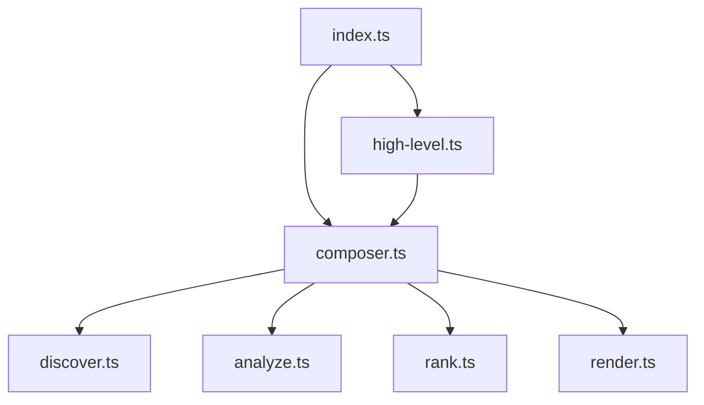

<div align="center">

<!-- TODO: Add a cool logo here -->
<!--  -->

# RepoGraph

### Your Codebase, Visualized & Understood.

**Generate rich, semantic, and interactive codemaps to navigate, analyze, and master any repository.**

[](https://www.npmjs.com/package/repograph)
[](./LICENSE)
[](https://github.com/your-username/repograph/actions)
[](http://makeapullrequest.com)

</div>

---

Ever felt lost in a new codebase? Struggled to see the big picture or find the most critical files? RepoGraph is your solution. It's a powerful command-line tool and library that analyzes your code, builds a dependency graph, ranks key files and symbols, and generates a beautiful, detailed Markdown report.

Whether you're onboarding new engineers, planning a large-scale refactor, or even providing context to an AI, RepoGraph gives you the map you need to navigate with confidence.

## ✨ Key Features & Benefits

| Feature | Benefit |
| :--- | :--- |
| **🧠 Multi-Language Semantic Analysis** | Uses **Tree-sitter** to parse your code with deep understanding, identifying not just files, but classes, functions, methods, and their relationships. |
| **⭐ Intelligent Ranking Algorithms** | Go beyond file names. Rank code by importance using **PageRank** (centrality) or **Git Hot-Spots** (change frequency) to immediately find what matters. |
| **🎨 Rich Markdown Reports** | Generates a comprehensive `repograph.md` file with a project overview, dependency graphs, ranked file lists, and detailed symbol breakdowns. |
| **📊 Automatic Mermaid.js Graphs** | Visualize your module dependencies with an automatically generated, easy-to-read Mermaid diagram right in your report. |
| **🧩 Composable Pipeline API** | A fully functional, composable API allows you to replace or extend any part of the pipeline: **Discover → Analyze → Rank → Render**. |
| **⚙️ Highly Configurable CLI** | Fine-tune your analysis and output with a rich set of command-line flags to include/ignore files, customize the report, and more. |

## 🚀 Why Use RepoGraph?

-   **Accelerate Onboarding:** Give new developers a guided tour of the codebase, highlighting the most important entry points and modules.
-   **Master Code Navigation:** Understand how components are interconnected, making it easier to trace logic and predict the impact of changes.
-   **Prioritize Refactoring:** Identify highly-central but frequently changed files—prime candidates for refactoring and stabilization.
-   **Enhance AI Context:** Feed a structured, ranked, and semantically-rich overview of your codebase to LLMs for vastly improved code generation, analysis, and Q&A.
-   **Streamline Architectural Reviews:** Get a high-level, data-driven view of your system's architecture to facilitate design discussions.

## 📸 Gallery: Example Output

Imagine running `repograph` on a small project. Here's a glimpse of the beautiful and insightful Markdown file it produces.

---

# RepoGraph

_Generated by RepoGraph on 2023-10-27T10:30:00.000Z_

## 🚀 Project Overview

This repository contains 25 nodes (5 files).

### Module Dependency Graph



### Top 5 Most Important Files

| Rank | File | Description |
| :--- | :--- | :--- |
| 1 | `src/pipeline/analyze.ts` | Key module in the architecture. |
| 2 | `src/index.ts` | Key module in the architecture. |
| 3 | `src/composer.ts` | Key module in the architecture. |
| 4 | `src/types.ts` | Key module in the architecture. |
| 5 | `src/pipeline/render.ts` | Key module in the architecture. |

---

## 📂 File & Symbol Breakdown

### [`src/pipeline/analyze.ts`](./src/pipeline/analyze.ts)

- **`function createTreeSitterAnalyzer`** - _L257_
  ```typescript
  export const createTreeSitterAnalyzer = (): Analyzer => {
  ```
- **`function processFileDefinitions`** - _L291_
  ```typescript
  function processFileDefinitions(
  ```
- **`function findEnclosingSymbolId`** (calls `parent`) - _L461_
  ```typescript
  function findEnclosingSymbolId(startNode: TSNode, file: FileContent, nodes: ReadonlyMap<string, CodeNode>): string | null {
  ```

---

## 📦 Installation

Install RepoGraph globally to use it as a CLI tool from anywhere on your system.

```bash
# Using npm
npm install -g repograph

# Using yarn
yarn global add repograph

# Using pnpm
pnpm add -g repograph
```

## 🛠️ Usage

### Command-Line Interface (CLI)

The CLI is the quickest way to get a codemap. Simply navigate to your project's root directory and run the command.

**Basic Usage**

```bash
# Analyze the current directory and create repograph.md
repograph
```

**Advanced Usage**

```bash
# Analyze a specific project, use the git-changes ranker, and customize the output
repograph ./my-cool-project \
  --output docs/CodeMap.md \
  --ranking-strategy git-changes \
  --ignore "**/__tests__/**" \
  --no-mermaid
```

#### All CLI Options

| Argument | Alias | Description | Default |
| :--- | :--- | :--- | :--- |
| `root` | | The root directory of the repository to analyze. | `.` |
| `--output <path>` | | Path to the output Markdown file. | `repograph.md` |
| `--include <pattern>` | | Glob pattern for files to include. Can be specified multiple times. | `**/*` |
| `--ignore <pattern>` | | Glob pattern for files to ignore. Can be specified multiple times. | |
| `--no-gitignore` | | Do not respect `.gitignore` files. | `false` |
| `--ranking-strategy <name>` | | Ranking strategy: `pagerank` or `git-changes`. | `pagerank` |
| `--log-level <level>` | | Logging level: `silent`, `error`, `warn`, `info`, `debug`. | `info` |
| `--help` | `-h` | Display the help message. | |
| `--version` | `-v` | Display the version number. | |
| **Output Formatting** | | | |
| `--no-header` | | Do not include the main "RepoGraph" header. | `false` |
| `--no-overview` | | Do not include the project overview section. | `false` |
| `--no-mermaid` | | Do not include the Mermaid dependency graph. | `false` |
| `--no-file-list` | | Do not include the list of top-ranked files. | `false` |
| `--no-symbol-details` | | Do not include the detailed file and symbol breakdown. | `false` |
| `--top-file-count <num>` | | Number of files in the top list. | `10` |
| `--file-section-separator <str>`| | Custom separator for file sections. | `---` |
| `--no-symbol-relations` | | Hide symbol relationship details (e.g., `calls`). | `false` |
| `--no-symbol-line-numbers` | | Hide line numbers for symbols. | `false` |
| `--no-symbol-snippets` | | Hide code snippets for symbols. | `false` |
| `--max-relations-to-show <num>`| | Max number of 'calls' relations to show per symbol. | `3` |

### 📚 Programmatic API

For ultimate flexibility, use the RepoGraph programmatic API. Integrate it into your own tools, build custom pipelines, and invent new ways to analyze code.

#### High-Level API (`generateMap`)

The easiest way to get started. It uses the default, battle-tested pipeline.

```typescript
// my-script.ts
import { generateMap } from 'repograph';
import path from 'node:path';

await generateMap({
  root: path.resolve('./path/to/your/project'),
  output: 'my-custom-report.md',
  rankingStrategy: 'git-changes',
  rendererOptions: {
    includeMermaidGraph: false,
    topFileCount: 20,
    symbolDetailOptions: {
      includeCodeSnippet: false,
    },
  },
});

console.log('✅ Report generated!');
```

#### Low-Level API (`createMapGenerator`)

Unleash the full power of RepoGraph's composable architecture. Swap out any part of the pipeline with your own implementation, and get the raw data back for custom processing.

In this example, we'll create a custom ranker that scores files based on line count, get the data back, and perform our own analysis before writing the report to a file.

```typescript
// my-advanced-script.ts
import {
  createMapGenerator,
  createDefaultDiscoverer,
  createTreeSitterAnalyzer,
  createMarkdownRenderer,
} from 'repograph';
import type { Ranker, CodeGraph, RankedCodeGraph, RepoGraphMap } from 'repograph';
import fs from 'node:fs/promises';

// 1. Define our custom ranker
const createLineCountRanker = (): Ranker => {
  return async (graph: CodeGraph): Promise<RankedCodeGraph> => {
    const ranks = new Map<string, number>();
    for (const [id, node] of graph.nodes) {
      // We only rank file nodes with this strategy
      if (node.type === 'file') {
        const lineCount = node.endLine - node.startLine;
        ranks.set(id, lineCount); // Simple score: more lines = higher rank
      } else {
        ranks.set(id, 0);
      }
    }
    // Normalize ranks between 0 and 1
    const maxRank = Math.max(...ranks.values(), 1);
    for (const [id, rank] of ranks.entries()) {
      ranks.set(id, rank / maxRank);
    }
    return { ...graph, ranks };
  };
};

// 2. Compose the pipeline with our custom ranker
const myCustomGenerator = createMapGenerator({
  discover: createDefaultDiscoverer(),
  analyze: createTreeSitterAnalyzer(),
  rank: createLineCountRanker(), // <-- Use our custom ranker here!
  render: createMarkdownRenderer(),
});

// 3. Run the generator to get the map object
const map: RepoGraphMap = await myCustomGenerator({
  root: './path/to/your/project',
  // By omitting 'output', the result is returned instead of written to a file.
});

// 4. Now you have full control over the output
console.log(`Generated map with ${map.graph.nodes.size} nodes.`);
console.log('Top 3 files by line count:');
[...map.graph.nodes.values()]
  .filter(n => n.type === 'file')
  .sort((a, b) => (map.graph.ranks.get(b.id) ?? 0) - (map.graph.ranks.get(a.id) ?? 0))
  .slice(0, 3)
  .forEach((file, i) => {
    console.log(`  ${i + 1}. ${file.filePath}`);
  });

// You can still write the markdown to a file if you want
await fs.writeFile('line-count-report.md', map.markdown);
console.log('✅ Custom report generated and saved!');
```

## 🔬 The RepoGraph Pipeline

RepoGraph processes your code in four distinct, composable stages:

1.  **`🔍 Discover`**
    -   Scans the filesystem using glob patterns.
    -   Respects `.gitignore` and custom ignore rules.
    -   Reads all matching files into memory.

2.  **`🧠 Analyze`**
    -   Groups files by language and parses them using **Tree-sitter**.
    -   Executes language-specific queries to find symbol definitions (classes, functions, etc.) and relationships (imports, calls, inheritance).
    -   Builds the core `CodeGraph` of nodes and edges.

3.  **`⭐ Rank`**
    -   Takes the `CodeGraph` as input.
    -   Applies a ranking algorithm (like PageRank) to assign a score to every node in the graph.
    -   Produces a `RankedCodeGraph`.

4.  **`🎨 Render`**
    -   Receives the `RankedCodeGraph` and rendering options.
    -   Generates the final, human-readable Markdown output, including the summary, Mermaid graph, and detailed breakdowns.

## 🌐 Supported Languages

Thanks to Tree-sitter, RepoGraph has robust support for a wide array of popular languages:

-   TypeScript / JavaScript (including JSX/TSX)
-   Python
-   Java
-   Go
-   Rust
-   C / C++
-   C#
-   PHP
-   Ruby
-   Solidity
-   Swift
-   Vue

*Support for more languages is on the roadmap!*

## 🙌 Contributing

Contributions are welcome! Whether you're fixing a bug, adding a feature, or improving documentation, your help is appreciated.

1.  Fork the repository.
2.  Create your feature branch (`git checkout -b feature/AmazingFeature`).
3.  Make your changes.
4.  Commit your changes (`git commit -m 'Add some AmazingFeature'`).
5.  Push to the branch (`git push origin feature/AmazingFeature`).
6.  Open a Pull Request.

The project uses `bun` for development, `eslint` for linting, and `prettier` for formatting. Please ensure your contributions adhere to the existing code style.

## 📜 License

This project is licensed under the **MIT License**. See the [LICENSE](./LICENSE) file for details.
