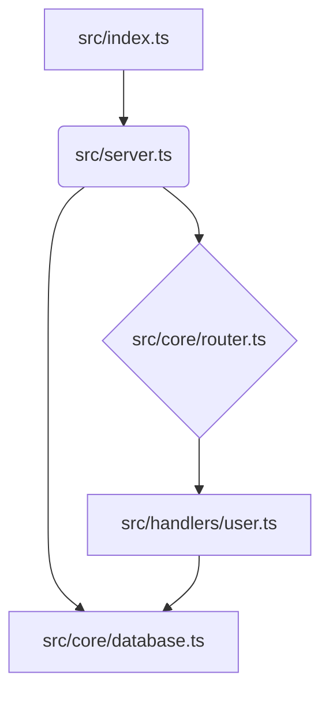

# RepoGraph: Technical API Specification

## 1. Vision & Core Philosophy

**RepoGraph** is a functional, immutable, and composable TypeScript library for generating rich, semantic codemaps in Markdown. Designed for the Bun.sh ecosystem, it provides a powerful, declarative API for analyzing and visualizing code repositories.

Our philosophy is rooted in functional programming:

*   **Immutability:** All data structures are immutable. Functions never modify their inputs; they return new, transformed data, eliminating side effects.
*   **Composition:** The entire process, from file discovery to rendering, is a pipeline of pure functions. Users can assemble their own pipelines by providing custom functions for any stage.
*   **Declarative API:** Users describe *what* they want the codemap to look like through configuration and function composition, rather than detailing *how* to build it step-by-step.

The result is a highly predictable and extensible library perfect for documentation generation, codebase exploration, and providing context to AI assistants.

## 2. Core Data Structures (Immutable Types)

These are the plain data types that flow through the functional pipeline.

```typescript
// Represents a single file read from disk.
export type FileContent = {
  readonly path: string;
  readonly content: string;
};

// Represents a single, identifiable symbol in the code.
export type CodeNode = {
  readonly id: string; // Unique identifier (e.g., 'src/api.ts#MyClass')
  readonly type: 'file' | 'class' | 'function' | 'interface' | 'variable';
  readonly name: string; // e.g., 'MyClass'
  readonly filePath: string;
  readonly startLine: number;
  readonly endLine: number;
  readonly codeSnippet?: string; // e.g., function signature
};

// Represents a directed relationship between two CodeNodes.
export type CodeEdge = {
  readonly fromId: string; // ID of the source CodeNode
  readonly toId: string;   // ID of the target CodeNode
  readonly type: 'imports' | 'calls' | 'inherits' | 'implements';
};

// The complete, raw model of the repository's structure.
export type CodeGraph = {
  readonly nodes: ReadonlyMap<string, CodeNode>;
  readonly edges: readonly CodeEdge[];
};

// A CodeGraph with an added 'rank' score for each node.
export type RankedCodeGraph = CodeGraph & {
  readonly ranks: ReadonlyMap<string, number>; // Key is CodeNode ID
};
```

## 3. The Functional Pipeline

RepoGraph operates as a data transformation pipeline. Each step is a pure function that takes data and returns a new, transformed version.

**`FileContent[]` → `CodeGraph` → `RankedCodeGraph` → `string (Markdown)`**

1.  **Discover:** A `FileDiscoverer` function scans the file system and produces an array of `FileContent` objects.
2.  **Analyze:** An `Analyzer` function takes the `FileContent[]` and produces a `CodeGraph` by parsing the code and identifying nodes and edges.
3.  **Rank:** A `Ranker` function takes the `CodeGraph` and produces a `RankedCodeGraph` by applying a scoring algorithm (e.g., PageRank).
4.  **Render:** A `Renderer` function takes the `RankedCodeGraph` and produces the final Markdown string.

## 4. API Reference

### 4.1. Main Function (`generateMap`)

The primary, easy-to-use entry point. It orchestrates the default pipeline based on a configuration object.

```typescript
async function generateMap(options: RepoGraphOptions): Promise<void>;
```

**`RepoGraphOptions`**

```typescript
export type RepoGraphOptions = {
  /** Root directory to analyze. @default process.cwd() */
  root: string;

  /** Output path for the Markdown file. @default './repograph.md' */
  output: string;

  /** Glob patterns for files to include. */
  include?: readonly string[];

  /** Glob patterns for files to exclude. */
  ignore?: readonly string[];

  /** Disables the use of .gitignore. @default false */
  noGitignore?: boolean;

  /** The ranking strategy to use. @default 'pagerank' */
  rankingStrategy?: 'pagerank' | 'git-changes' | 'alphabetical';

  /** Configuration for the final Markdown output. */
  rendererOptions?: {
    includeMermaidGraph?: boolean;
    includeSymbolDetails?: boolean;
    customHeader?: string;
  };
};
```

### 4.2. Core Function Types (The Contracts for Composition)

These types define the signatures for the functions that make up the pipeline.

```typescript
// Discovers files and returns their content.
export type FileDiscoverer = (config: {
  root: string;
  include?: readonly string[];
  ignore?: readonly string[];
  noGitignore?: boolean;
}) => Promise<readonly FileContent[]>;

// Analyzes file content and builds the dependency graph.
export type Analyzer = (files: readonly FileContent[]) => Promise<CodeGraph>;

// Ranks the nodes in a graph.
export type Ranker = (graph: CodeGraph) => Promise<RankedCodeGraph>;

// Renders a ranked graph into a string format.
export type Renderer = (graph: RankedCodeGraph, options?: any) => string;
```

### 4.3. Default Implementations (Function Factories)

RepoGraph provides default, configurable functions for each stage of the pipeline.

```typescript
// Creates the default file discoverer.
function createDefaultDiscoverer(): FileDiscoverer;

// Creates the default Tree-sitter-based analyzer.
function createTreeSitterAnalyzer(): Analyzer;

// Creates a ranker using the PageRank algorithm.
function createPageRanker(): Ranker;

// Creates a ranker based on Git commit history. Requires Git.
function createGitRanker(options: { maxCommits?: number }): Ranker;

// Creates the default Markdown renderer.
function createMarkdownRenderer(options: {
  includeMermaidGraph?: boolean;
  includeSymbolDetails?: boolean;
  customHeader?: string;
}): Renderer;
```

### 4.4. The Composer (Higher-Order Function)

For ultimate control, `createMapGenerator` is a Higher-Order Function that takes pipeline functions as arguments and returns a fully configured `generate` function.

```typescript
function createMapGenerator(pipeline: {
  discover: FileDiscoverer;
  analyze: Analyzer;
  rank: Ranker;
  render: Renderer;
}): (config: { root: string; output: string; /* discoverer options */ }) => Promise<void>;
```

## 5. Example Usage

### Simple Case (Using `generateMap`)

```typescript
import { generateMap } from 'repograph';

await generateMap({
  root: './my-project',
  output: './my-project/README.repograph.md',
  rankingStrategy: 'pagerank',
  rendererOptions: {
    customHeader: '# My Project Architecture',
  },
});
```

### Advanced Case (Using Composition and HOFs)

Here, we build a custom pipeline that uses a hypothetical "cyclomatic complexity" ranker instead of the default.

```typescript
import {
  createMapGenerator,
  createDefaultDiscoverer,
  createTreeSitterAnalyzer,
  createMarkdownRenderer,
} from 'repograph';
import type { CodeGraph, RankedCodeGraph, Ranker } from 'repograph';

// 1. Define our custom ranking function
const myComplexityRanker: Ranker = async (graph: CodeGraph): Promise<RankedCodeGraph> => {
  console.log('Using custom complexity ranker!');
  const ranks = new Map<string, number>();
  // ... custom logic to calculate complexity and assign rank ...
  for (const [id] of graph.nodes) {
    ranks.set(id, Math.random() * 100); // Placeholder
  }
  return { ...graph, ranks };
};

// 2. Create a map generator by composing our pipeline
const generateCustomMap = createMapGenerator({
  discover: createDefaultDiscoverer(),
  analyze: createTreeSitterAnalyzer(),
  rank: myComplexityRanker, // <-- Inject our custom function
  render: createMarkdownRenderer({ includeMermaidGraph: false }),
});

// 3. Run the composed generator
await generateCustomMap({
  root: './my-project',
  output: './docs/complexity-map.md',
  include: ['src/core/**/*'],
});
```

## 6. Example Markdown Output

The generated Markdown output remains rich and navigable, as specified previously, with dependency graphs, summary tables, and detailed symbol breakdowns.

````markdown
# RepoGraph for `my-project`

_Generated by RepoGraph on 2023-10-27_

## 🚀 Project Overview

This repository contains 42 source files. The analysis highlights the most central and interconnected modules that form the backbone of the application.

### Module Dependency Graph



### Top 10 Most Important Files (Ranked by PageRank)

| Rank | File | Key Symbols | Description |
| :--- | :--- | :--- | :--- |
| 1 | `src/core/database.ts` | `connectDB`, `query` | Central database connection and query module. Used by most handlers. |
| 2 | `src/server.ts` | `createServer`, `app` | Main Express server setup and middleware configuration. |
| ... | ... | ... | ... |

---

## 📂 File & Symbol Breakdown

### [`src/core/database.ts`](./src/core/database.ts)

Central database connection and query module. Used by most handlers.

-   **`function connectDB()`** - _L12_
    Establishes the main connection to the PostgreSQL database.
    ```typescript
    export async function connectDB(): Promise<void>
    ```

---
