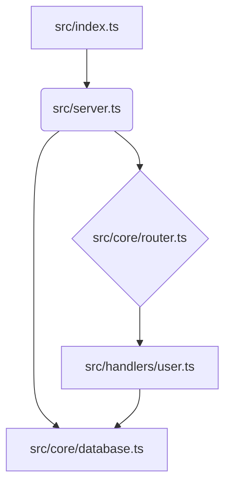

# RepoGraph 🚀

[](https://www.npmjs.com/package/repograph)
[](https://github.com/your-username/repograph/blob/main/LICENSE)
[](https://github.com/your-username/repograph/actions)
[](CONTRIBUTING.md)

**Your Codebase, Visualized. Generate rich, semantic, and interactive codemaps with a functional, composable API.**

RepoGraph analyzes your TypeScript/JavaScript repository, understands its structure, ranks the importance of files and symbols, and generates a beautiful, navigable Markdown document. It's perfect for onboarding new developers, enhancing code reviews, and providing deep context to AI assistants.

## ✨ Core Features

*   **🧠 Semantic Analysis:** Powered by Tree-sitter, RepoGraph goes beyond simple file listings. It parses your code to identify functions, classes, interfaces, and their relationships.
*   **📈 Smart Ranking:** Uses the **PageRank** algorithm to identify the most central and important files in your codebase, highlighting the true architectural backbone.
*   **🧩 Fully Composable:** Built with a functional-first philosophy. Every step—file discovery, analysis, ranking, and rendering—is a pluggable function. Don't like our ranker? Write your own and plug it in!
*   **🌐 Interactive Visualizations:** Generates **Mermaid.js** diagrams to create a visual, clickable dependency graph of your modules right inside your Markdown.
*   **🔧 Declarative & Simple API:** A high-level `generateMap` function gets you started in seconds with a single configuration object.
*   **🚀 Built for Modern JS:** A pure ESM library designed for the Bun.sh ecosystem, but compatible with Node.js.
*   **🛡️ Type-Safe & Immutable:** Written entirely in TypeScript, with a focus on immutable data structures for a predictable, side-effect-free experience.

## 🤔 Why RepoGraph?

Other tools can pack your repository into a single file. RepoGraph offers a fundamentally different approach:

| Traditional Approach | The RepoGraph Way |
| :--- | :--- |
| Imperative scripts that do one thing. | A **functional pipeline** (`Discover` -> `Analyze` -> `Rank` -> `Render`). |
| Hard-coded logic. | **Composable parts.** Swap out the ranker or renderer with your own logic. |
| Simply concatenates files. | **Semantic understanding.** It builds a true `CodeGraph` of nodes and edges. |
| Can be unpredictable. | **Immutable data structures** mean no side effects and total predictability. |

RepoGraph gives you the power to define *exactly* how your codebase is analyzed and presented, making it an incredibly powerful tool for documentation, analysis, and AI context generation.

## 📜 Example Output

Here’s a sample of what RepoGraph can generate.

<details>
<summary><strong>Click to view sample `repograph.md`</strong></summary>

````markdown
# RepoGraph for `my-project`

_Generated by RepoGraph on 2023-10-27_

## 🚀 Project Overview

This repository contains 42 source files. The analysis highlights the most central and interconnected modules that form the backbone of the application.

### Module Dependency Graph



### Top 10 Most Important Files (Ranked by PageRank)

| Rank | File | Key Symbols | Description |
| :--- | :--- | :--- | :--- |
| 1 | `src/core/database.ts` | `connectDB`, `query` | Central database connection and query module. Used by most handlers. |
| 2 | `src/server.ts` | `createServer`, `app` | Main Express server setup and middleware configuration. |
| ... | ... | ... | ... |

---

## 📂 File & Symbol Breakdown

### [`src/core/database.ts`](./src/core/database.ts)

Central database connection and query module. Used by most handlers.

-   **`function connectDB()`** - _L12_
    Establishes the main connection to the PostgreSQL database.
    ```typescript
    export async function connectDB(): Promise<void>
    ```
-   **`function query()`** - _L25_
    Executes a parameterized SQL query.
    ```typescript
    export async function query(sql: string, params: any[]): Promise<QueryResult>
    ```

---

### [`src/handlers/user.ts`](./src/handlers/user.ts)

Contains route handlers for user-related API endpoints.

-   _Imports from:_ `src/core/database.ts`
-   **`function getUserHandler()`** - _L8_
    Handles the `GET /users/:id` request.
    ```typescript
    export async function getUserHandler(req: Request, res: Response): Promise<void>
    ```
---
````

</details>

## 📦 Installation

```bash
# Using Bun
bun add repograph

# Using NPM
npm install repograph

# Using Yarn
yarn add repograph
```

## 🚀 Getting Started (High-Level API)

The easiest way to use RepoGraph is with the `generateMap` function. Create a script file (e.g., `scripts/gen-map.ts`) in your project:

```typescript
// scripts/gen-map.ts
import { generateMap } from 'repograph';
import { fileURLToPath } from 'url';
import path from 'path';

// Get the root directory of your project
const __dirname = path.dirname(fileURLToPath(import.meta.url));
const projectRoot = path.join(__dirname, '..');

await generateMap({
  root: projectRoot,
  output: path.join(projectRoot, 'repograph.md'),
  rankingStrategy: 'pagerank', // Or 'git-changes'
  rendererOptions: {
    customHeader: '# My Awesome Project Architecture',
    includeMermaidGraph: true,
  },
  // Optional: fine-tune file selection
  // include: ['src/core/**/*'],
  // ignore: ['**/*.spec.ts'],
});

console.log('RepoGraph generated successfully!');
```

Then, add a script to your `package.json`:

```json
{
  "scripts": {
    "map": "bun run scripts/gen-map.ts"
  }
}
```

Now you can generate your codemap anytime by running:

```bash
bun run map
```

## 🛠️ Advanced Usage & Composition (Low-Level API)

The true power of RepoGraph lies in its composable, functional pipeline. You can replace any part of the process with your own implementation.

The pipeline is: `Discover` → `Analyze` → `Rank` → `Render`

Here’s how you can create your own custom map generator using this pipeline. Let's create a custom ranker that scores files based on the number of `// TODO:` comments.

```typescript
// scripts/custom-map.ts
import {
  createMapGenerator,
  createDefaultDiscoverer,
  createTreeSitterAnalyzer,
  createMarkdownRenderer,
} from 'repograph';
import type { CodeGraph, RankedCodeGraph, Ranker, FileContent } from 'repograph';

// 1. Define our custom ranking function.
// It must match the `Ranker` type signature.
const todoCommentRanker: Ranker = (graph: CodeGraph, files: readonly FileContent[]): RankedCodeGraph => {
  console.log('Using custom TODO comment ranker!');

  const fileContentMap = new Map(files.map(f => [f.path, f.content]));
  const ranks = new Map<string, number>();

  // Iterate over every file node in the graph
  for (const [id, node] of graph.nodes) {
    if (node.type === 'file') {
      const content = fileContentMap.get(node.filePath) || '';
      const todoCount = (content.match(/\/\/\s*TODO:/gi) || []).length;
      ranks.set(id, todoCount);
    }
  }

  // Return a new RankedCodeGraph with our custom ranks
  return { ...graph, ranks };
};

// 2. Create a map generator by composing our custom pipeline.
// We provide our custom ranker and use defaults for the rest.
const generateCustomMap = createMapGenerator({
  discover: createDefaultDiscoverer(),
  analyze: createTreeSitterAnalyzer(),
  rank: todoCommentRanker, // <-- Inject our custom ranker!
  render: createMarkdownRenderer({
    customHeader: '# Codebase TODO Hotspots',
    includeMermaidGraph: false, // Let's disable the graph for this report
  }),
});

// 3. Run the composed generator with its own config.
await generateCustomMap({
  root: './',
  output: './docs/todo-report.md',
  include: ['src/**/*'],
});

console.log('Custom TODO report generated!');
```

This demonstrates the core philosophy: **RepoGraph provides the framework and sensible defaults, but you have ultimate control to shape the analysis to your exact needs.**

## API Reference

### `generateMap(options)`

The main high-level function.

**`RepoGraphOptions`**

| Option | Type | Default | Description |
| :--- | :--- | :--- | :--- |
| `root` | `string` | `process.cwd()` | The root directory of the repository to analyze. |
| `output` | `string` | `'./repograph.md'` | The file path where the final Markdown will be saved. |
| `include` | `readonly string[]` | `undefined` | An array of glob patterns to include. |
| `ignore` | `readonly string[]` | `undefined` | An array of glob patterns to exclude. |
| `noGitignore` | `boolean` | `false` | If true, `.gitignore` files will be ignored. |
| `rankingStrategy` | `'pagerank' \| 'git-changes'` | `'pagerank'` | The pre-built ranking strategy to use. |
| `rendererOptions`| `object` | `{}` | Options passed directly to the Markdown renderer. |
| `rendererOptions.customHeader` | `string` | `undefined` | Custom text to appear at the top of the Markdown file. |
| `rendererOptions.includeMermaidGraph` | `boolean` | `true` | Whether to include the Mermaid dependency graph. |
| `rendererOptions.includeSymbolDetails` | `boolean` | `true` | Whether to include detailed breakdowns of functions/classes. |

### `createMapGenerator(pipeline)`

A Higher-Order Function that creates a custom generator. It takes a `pipeline` object with four properties:

*   `discover: FileDiscoverer`
*   `analyze: Analyzer`
*   `rank: Ranker`
*   `render: Renderer`

RepoGraph exports default factories for each of these so you can mix and match:
*   `createDefaultDiscoverer()`
*   `createTreeSitterAnalyzer()`
*   `createPageRanker()`
*   `createGitRanker()`
*   `createMarkdownRenderer(options)`

## 🤝 Contributing

Contributions are welcome! Please feel free to submit a Pull Request or open an issue. See our [Contributing Guide](CONTRIBUTING.md) for more details.

## 📄 License

This project is licensed under the MIT License. See the [LICENSE](LICENSE) file for details.
