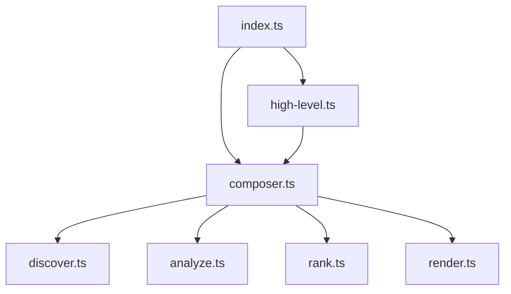

# Directory Structure
```
test/
  integration/
    multi-language.test.ts
  unit/
    analyze.test.ts
    composer.test.ts
  test.util.ts
README.md
```

# Files

## File: test/unit/analyze.test.ts
````typescript
import { describe, it, beforeEach, afterEach, expect } from 'bun:test';
import { createTreeSitterAnalyzer } from '../../src/pipeline/analyze.js';
import type { FileContent } from '../../src/types.js';
import {
  createTempDir,
  cleanupTempDir,
  loadFixture,
  createProjectFromFixture
} from '../test.util.js';

describe('Tree-sitter Analysis', () => {
  let tempDir: string;
  let analyzer: ReturnType<typeof createTreeSitterAnalyzer>;

  beforeEach(async () => {
    tempDir = await createTempDir();
    analyzer = createTreeSitterAnalyzer();
  });

  afterEach(async () => {
    await cleanupTempDir(tempDir);
  });

  describe('createTreeSitterAnalyzer()', () => {
    it('should return an Analyzer function', () => {
      expect(typeof analyzer).toBe('function');
    });

    it('should create a CodeGraph from file content', async () => {
      const files: FileContent[] = [
        {
          path: 'src/index.ts',
          content: `export function hello(): string {
  return 'Hello, World!';
}`
        }
      ];

      const graph = await analyzer(files);

      expect(graph).toBeDefined();
      expect(graph.nodes.size).toBeGreaterThan(0); // Should have nodes
    });

    it('should add file nodes to the graph', async () => {
      const files: FileContent[] = [
        {
          path: 'src/index.ts',
          content: 'export const hello = "world";'
        },
        {
          path: 'src/utils.ts',
          content: 'export const util = () => {};'
        }
      ];

      const graph = await analyzer(files);

      expect(graph.nodes.has('src/index.ts')).toBe(true);
      expect(graph.nodes.has('src/utils.ts')).toBe(true);

      const indexNode = graph.nodes.get('src/index.ts');
      expect(indexNode!.type).toBe('file');
      expect(indexNode!.name).toBe('index.ts');
      expect(indexNode!.filePath).toBe('src/index.ts');
    });

    it('should identify function declarations', async () => {
      const files: FileContent[] = [
        {
          path: 'src/functions.ts',
          content: `export function add(a: number, b: number): number {
  return a + b;
}

export function multiply(x: number, y: number): number {
  return x * y;
}`
        }
      ];

      const graph = await analyzer(files);

      expect(graph.nodes.has('src/functions.ts#add')).toBe(true);
      expect(graph.nodes.has('src/functions.ts#multiply')).toBe(true);

      const addNode = graph.nodes.get('src/functions.ts#add');
      expect(addNode!.type).toBe('function');
      expect(addNode!.name).toBe('add');
      expect(addNode!.filePath).toBe('src/functions.ts');
      expect(addNode!.startLine).toBeGreaterThan(0);
    });

    it('should identify arrow function declarations', async () => {
      const files: FileContent[] = [
        {
          path: 'src/arrows.ts',
          content: `export const greet = (name: string): string => {
  return \`Hello, \${name}!\`;
};

const calculate = (x: number, y: number): number => x + y;`
        }
      ];

      const graph = await analyzer(files);

      expect(graph.nodes.has('src/arrows.ts#greet')).toBe(true);
      expect(graph.nodes.has('src/arrows.ts#calculate')).toBe(true);

      const greetNode = graph.nodes.get('src/arrows.ts#greet');
      expect(greetNode!.type).toBe('arrow_function');
      expect(greetNode!.name).toBe('greet');
    });

    it('should identify class declarations', async () => {
      const files: FileContent[] = [
        {
          path: 'src/classes.ts',
          content: `export class Calculator {
  private value: number = 0;
  
  add(n: number): this {
    this.value += n;
    return this;
  }
}

class Logger {
  log(message: string): void {
    console.log(message);
  }
}`
        }
      ];

      const graph = await analyzer(files);

      expect(graph.nodes.has('src/classes.ts#Calculator')).toBe(true);
      expect(graph.nodes.has('src/classes.ts#Logger')).toBe(true);

      const calculatorNode = graph.nodes.get('src/classes.ts#Calculator');
      expect(calculatorNode!.type).toBe('class');
      expect(calculatorNode!.name).toBe('Calculator');
      expect(calculatorNode!.codeSnippet).toContain('export class Calculator');
    });

    it('should identify interface declarations', async () => {
      const files: FileContent[] = [
        {
          path: 'src/interfaces.ts',
          content: `export interface User {
  id: number;
  name: string;
  email: string;
}

interface Config {
  debug: boolean;
  version: string;
}`
        }
      ];

      const graph = await analyzer(files);

      expect(graph.nodes.has('src/interfaces.ts#User')).toBe(true);
      expect(graph.nodes.has('src/interfaces.ts#Config')).toBe(true);

      const userNode = graph.nodes.get('src/interfaces.ts#User');
      expect(userNode!.type).toBe('interface');
      expect(userNode!.name).toBe('User');
    });

    it('should identify type alias declarations', async () => {
      const files: FileContent[] = [
        {
          path: 'src/types.ts',
          content: `export type Status = 'active' | 'inactive' | 'pending';

type Handler = (event: Event) => void;

export type UserRole = 'admin' | 'user' | 'guest';`
        }
      ];

      const graph = await analyzer(files);

      expect(graph.nodes.has('src/types.ts#Status')).toBe(true);
      expect(graph.nodes.has('src/types.ts#Handler')).toBe(true);
      expect(graph.nodes.has('src/types.ts#UserRole')).toBe(true);

      const statusNode = graph.nodes.get('src/types.ts#Status');
      expect(statusNode!.type).toBe('type');
      expect(statusNode!.name).toBe('Status');
    });

    it('should identify import statements and create edges', async () => {
      const files: FileContent[] = [
        {
          path: 'src/index.ts',
          content: `import { Calculator } from './calculator.js';
import { Logger } from './utils/logger.js';

export { Calculator, Logger };`
        },
        {
          path: 'src/calculator.ts',
          content: `export class Calculator {
  add(a: number, b: number): number {
    return a + b;
  }
}`
        },
        {
          path: 'src/utils/logger.ts',
          content: `export class Logger {
  log(message: string): void {
    console.log(message);
  }
}`
        }
      ];

      const graph = await analyzer(files);

      // Check if import edges exist
      const hasCalculatorImport = graph.edges.some(e => e.fromId === 'src/index.ts' && e.toId === 'src/calculator.ts');
      const hasLoggerImport = graph.edges.some(e => e.fromId === 'src/index.ts' && e.toId === 'src/utils/logger.ts');
      
      expect(hasCalculatorImport).toBe(true);
      expect(hasLoggerImport).toBe(true);
    });

    it('should handle files with no symbols gracefully', async () => {
      const files: FileContent[] = [
        {
          path: 'README.md',
          content: '# Project\n\nThis is a readme file.'
        },
        {
          path: 'src/empty.ts',
          content: '// This file is empty\n'
        }
      ];

      const graph = await analyzer(files);

      // Should still create file nodes
      expect(graph.nodes.has('README.md')).toBe(true);
      expect(graph.nodes.has('src/empty.ts')).toBe(true);

      const readmeNode = graph.nodes.get('README.md');
      expect(readmeNode!.type).toBe('file');
    });

    it('should handle malformed or unparseable files gracefully', async () => {
      const files: FileContent[] = [
        {
          path: 'src/valid.ts',
          content: 'export const valid = true;'
        },
        {
          path: 'src/invalid.ts',
          content: 'this is not valid typescript syntax {'
        }
      ];

      const graph = await analyzer(files);

      // Should still create file nodes for both
      expect(graph.nodes.has('src/valid.ts')).toBe(true);
      expect(graph.nodes.has('src/invalid.ts')).toBe(true);
    });

    it('should set correct line numbers for symbols', async () => {
      const files: FileContent[] = [
        {
          path: 'src/multiline.ts',
          content: `// Line 1
// Line 2
export class FirstClass {
  // Line 4
  method(): void {}
}

// Line 8
export function secondFunction(): string {
  return 'hello';
}

// Line 13
export interface ThirdInterface {
  prop: string;
}`
        }
      ];

      const graph = await analyzer(files);

      const firstClass = graph.nodes.get('src/multiline.ts#FirstClass');
      const secondFunction = graph.nodes.get('src/multiline.ts#secondFunction');
      const thirdInterface = graph.nodes.get('src/multiline.ts#ThirdInterface');

      expect(firstClass!.startLine).toBe(3);
      expect(secondFunction!.startLine).toBe(9);
      expect(thirdInterface!.startLine).toBe(14);

      expect(firstClass!.endLine).toBeGreaterThan(firstClass!.startLine);
      expect(secondFunction!.endLine).toBeGreaterThan(secondFunction!.startLine);
      expect(thirdInterface!.endLine).toBeGreaterThan(thirdInterface!.startLine);
    });

    it('should include code snippets for symbols', async () => {
      const files: FileContent[] = [
        {
          path: 'src/snippets.ts',
          content: `export class Calculator {
  private value: number = 0;
  
  add(n: number): this {
    this.value += n;
    return this;
  }
}

export function multiply(a: number, b: number): number {
  return a * b;
}`
        }
      ];

      const graph = await analyzer(files);

      const calculatorNode = graph.nodes.get('src/snippets.ts#Calculator');
      const multiplyNode = graph.nodes.get('src/snippets.ts#multiply');

      expect(calculatorNode!.codeSnippet).toContain('export class Calculator');
      expect(multiplyNode!.codeSnippet).toContain('export function multiply(a: number, b: number): number');
    });

    it('should handle complex import patterns', async () => {
      const files: FileContent[] = [
        {
          path: 'src/imports.ts',
          content: `import { Calculator } from './math/calculator.js';
import * as utils from './utils.js';
import type { Config } from './config.js';
import Logger, { LogLevel } from './logger.js';`
        },
        {
          path: 'src/math/calculator.ts',
          content: 'export class Calculator {}'
        },
        {
          path: 'src/utils.ts',
          content: 'export const helper = () => {};'
        },
        {
          path: 'src/config.ts',
          content: 'export interface Config {}'
        },
        {
          path: 'src/logger.ts',
          content: 'export default class Logger {}'
        }
      ];

      const graph = await analyzer(files);

      // Check import edges
      const hasCalcImport = graph.edges.some(e => e.fromId === 'src/imports.ts' && e.toId === 'src/math/calculator.ts');
      const hasUtilsImport = graph.edges.some(e => e.fromId === 'src/imports.ts' && e.toId === 'src/utils.ts');
      const hasConfigImport = graph.edges.some(e => e.fromId === 'src/imports.ts' && e.toId === 'src/config.ts');
      const hasLoggerImport = graph.edges.some(e => e.fromId === 'src/imports.ts' && e.toId === 'src/logger.ts');
      expect(hasCalcImport).toBe(true);
      expect(hasUtilsImport).toBe(true);
      expect(hasConfigImport).toBe(true);
      expect(hasLoggerImport).toBe(true);
    });

    it('should handle nested class and function definitions', async () => {
      const files: FileContent[] = [
        {
          path: 'src/nested.ts',
          content: `export class OuterClass {
  private inner = class InnerClass {
    method(): void {}
  };
  
  outerMethod(): void {
    function nestedFunction(): string {
      return 'nested';
    }
    nestedFunction();
  }
}`
        }
      ];

      const graph = await analyzer(files);

      // Should identify the outer class
      expect(graph.nodes.has('src/nested.ts#OuterClass')).toBe(true);
      
      const outerClass = graph.nodes.get('src/nested.ts#OuterClass');
      expect(outerClass!.type).toBe('class');
      expect(outerClass!.name).toBe('OuterClass');
    });

    it('should handle circular imports gracefully', async () => {
      const files: FileContent[] = [
        {
          path: 'src/a.ts',
          content: `import { B } from './b.js';
export class A {
  b: B;
}`
        },
        {
          path: 'src/b.ts',
          content: `import { A } from './a.js';
export class B {
  a: A;
}`
        }
      ];

      const graph = await analyzer(files);

      const aToB = graph.edges.some(e => e.fromId === 'src/a.ts' && e.toId === 'src/b.ts');
      const bToA = graph.edges.some(e => e.fromId === 'src/b.ts' && e.toId === 'src/a.ts');
      
      expect(aToB).toBe(true);
      expect(bToA).toBe(true);
      expect(graph.nodes.has('src/a.ts#A')).toBe(true);
      expect(graph.nodes.has('src/b.ts#B')).toBe(true);
    });
    it('should not create duplicate nodes for the same symbol', async () => {
      const files: FileContent[] = [
        {
          path: 'src/duplicate.ts',
          content: `export class Calculator {
  add(a: number, b: number): number {
    return a + b;
  }
}

// This should not create a duplicate
export class Calculator {
  multiply(a: number, b: number): number {
    return a * b;
  }
}`
        }
      ];

      const graph = await analyzer(files);

      // Should only have one Calculator node (first one wins)
      const calculatorNodes = [...graph.nodes.keys()].filter((nodeId) =>
        nodeId.includes('#Calculator')
      );
      expect(calculatorNodes.length).toBe(1);
    });
  });

  describe('Integration with Fixtures', () => {
    it('should analyze sample-project fixture correctly', async () => {
      const fixture = await loadFixture('sample-project');
      await createProjectFromFixture(tempDir, fixture);

      const files: FileContent[] = [];
      for (const file of fixture.files) {
        if (file.path.endsWith('.ts')) {
          files.push({
            path: file.path,
            content: file.content
          });
        }
      }

      const graph = await analyzer(files);

      expect(graph.nodes.size).toBe(fixture.expected_nodes!);
      
      // Check for specific symbols from the fixture
      expect(graph.nodes.has('src/calculator.ts#Calculator')).toBe(true);
      expect(graph.nodes.has('src/utils/logger.ts#Logger')).toBe(true);
      expect(graph.nodes.has('src/types.ts#Config')).toBe(true);
    });

    it('should analyze complex-project fixture correctly', async () => {
      const fixture = await loadFixture('complex-project');
      await createProjectFromFixture(tempDir, fixture);

      const files: FileContent[] = [];
      for (const file of fixture.files) {
        if (file.path.endsWith('.ts') && !file.path.includes('test')) {
          files.push({
            path: file.path,
            content: file.content
          });
        }
      }

      const graph = await analyzer(files);

      // Check for key classes and interfaces
      expect(graph.nodes.has('src/database/index.ts#Database')).toBe(true);
      expect(graph.nodes.has('src/api/server.ts#ApiServer')).toBe(true);
      expect(graph.nodes.has('src/services/user.ts#UserService')).toBe(true);
      
      // Check for import relationships
      const serverToDb = graph.edges.some(e => e.fromId === 'src/api/server.ts' && e.toId === 'src/database/index.ts');
      const serverToUser = graph.edges.some(e => e.fromId === 'src/api/server.ts' && e.toId === 'src/services/user.ts');
      expect(serverToDb).toBe(true);
      expect(serverToUser).toBe(true);
    });

    it('should handle minimal-project fixture', async () => {
      const fixture = await loadFixture('minimal-project');
      await createProjectFromFixture(tempDir, fixture);

      const files: FileContent[] = [
        {
          path: 'src/main.ts',
          content: fixture.files[0]!.content
        }
      ];

      const graph = await analyzer(files);

      expect(graph.nodes.has('src/main.ts')).toBe(true);
      expect(graph.nodes.has('src/main.ts#hello')).toBe(true);
      expect(graph.nodes.has('src/main.ts#greet')).toBe(true);

      const helloNode = graph.nodes.get('src/main.ts#hello');
      const greetNode = graph.nodes.get('src/main.ts#greet');

      expect(helloNode!.type).toBe('function');
      expect(greetNode!.type).toBe('arrow_function');
    });
  });
});
````

## File: test/test.util.ts
````typescript
import fs from 'node:fs/promises';
import path from 'node:path';
import { tmpdir } from 'node:os';
import yaml from 'js-yaml';
import type { FileContent, CodeNode, CodeGraph, CodeEdge, RepoGraphOptions } from '../src/types.js';
import { generateMap } from '../src/high-level.js';
import { execSync } from 'node:child_process';

/**
 * Test utilities for RepoGraph testing
 */

/**
 * Creates a temporary directory for testing
 */
export const createTempDir = async (): Promise<string> => {
  const tempDir = await fs.mkdtemp(path.join(tmpdir(), 'repograph-test-'));
  return tempDir;
};

/**
 * Cleans up a temporary directory
 */
export const cleanupTempDir = async (dir: string): Promise<void> => {
  try {
    await fs.rm(dir, { recursive: true, force: true });
  } catch (error) {
    // Ignore cleanup errors
  }
};

/**
 * Creates a test file structure in a directory
 */
export const createTestFiles = async (
  baseDir: string,
  files: Record<string, string>
): Promise<void> => {
  for (const [filePath, content] of Object.entries(files)) {
    const fullPath = path.join(baseDir, filePath);
    await fs.mkdir(path.dirname(fullPath), { recursive: true });
    await fs.writeFile(fullPath, content);
  }
};

/**
 * Creates a .gitignore file in the specified directory
 */
export const createGitignore = async (
  baseDir: string,
  patterns: string[]
): Promise<void> => {
  const gitignorePath = path.join(baseDir, '.gitignore');
  await fs.writeFile(gitignorePath, patterns.join('\n'));
};

/**
 * Reads all files in a directory recursively
 */
export const readAllFiles = async (dir: string): Promise<FileContent[]> => {
  const files: FileContent[] = [];
  
  const readDir = async (currentDir: string, relativePath = ''): Promise<void> => {
    const entries = await fs.readdir(currentDir, { withFileTypes: true });
    
    for (const entry of entries) {
      const entryPath = path.join(currentDir, entry.name);
      const relativeEntryPath = path.join(relativePath, entry.name);
      
      if (entry.isDirectory()) {
        await readDir(entryPath, relativeEntryPath);
      } else if (entry.isFile()) {
        try {
          const content = await fs.readFile(entryPath, 'utf-8');
          files.push({
            path: relativeEntryPath.replace(/\\/g, '/'), // Normalize path separators
            content
          });
        } catch {
          // Skip files that can't be read
        }
      }
    }
  };
  
  await readDir(dir);
  return files;
};

/**
 * Creates sample TypeScript files for testing
 */
export const createSampleTSFiles = (): Record<string, string> => {
  return {
    'src/index.ts': `export { Calculator } from './calculator.js';
export { Logger } from './utils/logger.js';`,
    
    'src/calculator.ts': `import { Logger } from './utils/logger.js';

export class Calculator {
  private logger: Logger;
  
  constructor() {
    this.logger = new Logger();
  }
  
  add(a: number, b: number): number {
    this.logger.log('Adding numbers');
    return a + b;
  }
  
  multiply = (a: number, b: number): number => {
    return a * b;
  };
}`,
    
    'src/utils/logger.ts': `export interface LogLevel {
  level: 'info' | 'warn' | 'error';
}

export type LogMessage = string;

export class Logger {
  log(message: LogMessage): void {
    console.log(message);
  }
  
  warn(message: LogMessage): void {
    console.warn(message);
  }
}

export const createLogger = (): Logger => {
  return new Logger();
};`,
    
    'src/types.ts': `export interface Config {
  debug: boolean;
  version: string;
}

export type Status = 'active' | 'inactive';`,
    
    'README.md': '# Test Project\n\nThis is a test project.',
    
    'package.json': JSON.stringify({
      name: 'test-project',
      version: '1.0.0',
      type: 'module'
    }, null, 2)
  };
};

/**
 * Creates a minimal test project structure
 */
export const createMinimalProject = (): Record<string, string> => {
  return {
    'src/main.ts': `export function hello(): string {
  return 'Hello, World!';
}`,
    'package.json': JSON.stringify({
      name: 'minimal-project',
      version: '1.0.0'
    }, null, 2)
  };
};

/**
 * Asserts that a file exists
 */
export const assertFileExists = async (filePath: string): Promise<void> => {
  try {
    await fs.access(filePath);
  } catch {
    throw new Error(`File does not exist: ${filePath}`);
  }
};

/**
 * Reads a file and returns its content
 */
export const readFile = async (filePath: string): Promise<string> => {
  return await fs.readFile(filePath, 'utf-8');
};

/**
 * Checks if a directory exists
 */
export const directoryExists = async (dirPath: string): Promise<boolean> => {
  try {
    const stat = await fs.stat(dirPath);
    return stat.isDirectory();
  } catch {
    return false;
  }
};

/**
 * Creates a symbolic link for testing
 */
export const createSymlink = async (target: string, linkPath: string): Promise<void> => {
  try {
    await fs.symlink(target, linkPath);
  } catch {
    // Ignore symlink creation errors (may not be supported on all platforms)
  }
};

/**
 * Validates that a string contains valid Markdown
 */
export const isValidMarkdown = (content: string): boolean => {
  // Basic markdown validation: check for headers or the standard empty message.
  const hasHeaders = /^#{1,6}\s+.+$/m.test(content);
  const hasEmptyMessage = /This repository contains 0 nodes/.test(content);
  return hasHeaders || hasEmptyMessage;
};

/**
 * Validates that a string contains valid Mermaid syntax
 */
export const containsValidMermaid = (content: string): boolean => {
  return content.includes('```mermaid') && content.includes('graph TD');
};

/**
 * Extracts file paths from markdown content
 */
export const extractFilePathsFromMarkdown = (content: string): string[] => {
  const pathRegex = /`([^`]+\.(ts|js|tsx|jsx|py|java|go|rs|c))`/g;
  const paths: string[] = [];
  let match;
  
  while ((match = pathRegex.exec(content)) !== null) {
    if (match[1]) {
      paths.push(match[1]);
    }
  }
  
  return paths;
};

/**
 * Test fixture structure
 */
export interface TestFixture {
  name: string;
  description: string;
  files: Array<{
    path: string;
    content: string;
  }>;
  gitignore?: string[];
  expected_nodes?: number;
  expected_files?: number;
  expected_symbols?: number;
}

/**
 * Loads a test fixture from a YAML file
 */
export const loadFixture = async (fixtureName: string): Promise<TestFixture> => {
  // Get the correct path relative to the project root
  const projectRoot = process.cwd().endsWith('/test') ? path.dirname(process.cwd()) : process.cwd();
  const fixturePath = path.join(projectRoot, 'test', 'fixtures', `${fixtureName}.yaml`);
  const content = await fs.readFile(fixturePath, 'utf-8');
  return yaml.load(content) as TestFixture;
};

/**
 * Creates a test project from a fixture
 */
export const createProjectFromFixture = async (
  baseDir: string,
  fixture: TestFixture
): Promise<void> => {
  // Create files
  const fileMap: Record<string, string> = {};
  for (const file of fixture.files) {
    fileMap[file.path] = file.content;
  }
  await createTestFiles(baseDir, fileMap);
  
  // Create .gitignore if specified
  if (fixture.gitignore && fixture.gitignore.length > 0) {
    await createGitignore(baseDir, fixture.gitignore);
  }
};

// --- Radically DRY Test Helpers ---

/**
 * A powerful, centralized test runner that handles setup, execution, and cleanup.
 */
export const runRepoGraphForTests = async (
  files: Record<string, string>,
  options: Partial<RepoGraphOptions> = {}
): Promise<string> => {
  const tempDir = await createTempDir();
  try {
    await createTestFiles(tempDir, files);
    const outputPath = path.join(tempDir, 'output.md');

    if (options.rankingStrategy === 'git-changes') {
      await setupGitRepo(tempDir);
      await makeGitCommit(tempDir, 'Initial commit');
    }

    await generateMap({
      root: tempDir,
      output: outputPath,
      ...options,
    });
    return await readFile(outputPath);
  } finally {
    await cleanupTempDir(tempDir);
  }
};

/**
 * Creates a mock CodeNode for testing.
 */
export const createTestNode = (id: string, partial: Partial<CodeNode> = {}): CodeNode => ({
  id,
  type: 'file',
  name: path.basename(id),
  filePath: id.split('#')[0]!,
  startLine: 1,
  endLine: 10,
  ...partial,
});

/**
 * Creates a mock CodeGraph for testing.
 */
export const createTestGraph = (nodes: CodeNode[], edges: CodeEdge[] = []): CodeGraph => ({
  nodes: new Map(nodes.map(n => [n.id, n])),
  edges,
});

/**
 * Initializes a git repository in the given directory.
 */
export const setupGitRepo = async (dir: string) => {
  try {
    execSync('git init', { cwd: dir, stdio: 'ignore' });
    execSync('git config user.email "test@example.com"', { cwd: dir, stdio: 'ignore' });
    execSync('git config user.name "Test User"', { cwd: dir, stdio: 'ignore' });
  } catch (e) {
    // Silently fail if git is not available
  }
};

/**
 * Makes a git commit in the given repository.
 */
export const makeGitCommit = async (dir: string, message: string, files?: string[]) => {
  try {
    const filesToAdd = files ? files.join(' ') : '.';
    execSync(`git add ${filesToAdd}`, { cwd: dir, stdio: 'ignore' });
    execSync(`git commit -m "${message}"`, { cwd: dir, stdio: 'ignore' });
  } catch (e) {
    // Silently fail if git is not available
  }
};
````

## File: README.md
````markdown
<div align="center">

<!-- TODO: Add a cool logo here -->
<!--  -->

# RepoGraph

### Your Codebase, Visualized & Understood.

**Generate rich, semantic, and interactive codemaps to navigate, analyze, and master any repository.**

[](https://www.npmjs.com/package/repograph)
[](./LICENSE)
[](https://github.com/your-username/repograph/actions)
[](http://makeapullrequest.com)

</div>

---

Ever felt lost in a new codebase? Struggled to see the big picture or find the most critical files? RepoGraph is your solution. It's a powerful command-line tool and library that analyzes your code, builds a dependency graph, ranks key files and symbols, and generates a beautiful, detailed Markdown report.

Whether you're onboarding new engineers, planning a large-scale refactor, or even providing context to an AI, RepoGraph gives you the map you need to navigate with confidence.

## ✨ Key Features & Benefits

| Feature | Benefit |
| :--- | :--- |
| **🧠 Multi-Language Semantic Analysis** | Uses **Tree-sitter** to parse your code with deep understanding, identifying not just files, but classes, functions, methods, and their relationships. |
| **⭐ Intelligent Ranking Algorithms** | Go beyond file names. Rank code by importance using **PageRank** (centrality) or **Git Hot-Spots** (change frequency) to immediately find what matters. |
| **🎨 Rich Markdown Reports** | Generates a comprehensive `repograph.md` file with a project overview, dependency graphs, ranked file lists, and detailed symbol breakdowns. |
| **📊 Automatic Mermaid.js Graphs** | Visualize your module dependencies with an automatically generated, easy-to-read Mermaid diagram right in your report. |
| **🧩 Composable Pipeline API** | A fully functional, composable API allows you to replace or extend any part of the pipeline: **Discover → Analyze → Rank → Render**. |
| **⚙️ Highly Configurable CLI** | Fine-tune your analysis and output with a rich set of command-line flags to include/ignore files, customize the report, and more. |

## 🚀 Why Use RepoGraph?

-   **Accelerate Onboarding:** Give new developers a guided tour of the codebase, highlighting the most important entry points and modules.
-   **Master Code Navigation:** Understand how components are interconnected, making it easier to trace logic and predict the impact of changes.
-   **Prioritize Refactoring:** Identify highly-central but frequently changed files—prime candidates for refactoring and stabilization.
-   **Enhance AI Context:** Feed a structured, ranked, and semantically-rich overview of your codebase to LLMs for vastly improved code generation, analysis, and Q&A.
-   **Streamline Architectural Reviews:** Get a high-level, data-driven view of your system's architecture to facilitate design discussions.

## 📸 Gallery: Example Output

Imagine running `repograph` on a small project. Here's a glimpse of the beautiful and insightful Markdown file it produces.

---

# RepoGraph

_Generated by RepoGraph on 2023-10-27T10:30:00.000Z_

## 🚀 Project Overview

This repository contains 25 nodes (5 files).

### Module Dependency Graph



### Top 5 Most Important Files

| Rank | File | Description |
| :--- | :--- | :--- |
| 1 | `src/pipeline/analyze.ts` | Key module in the architecture. |
| 2 | `src/index.ts` | Key module in the architecture. |
| 3 | `src/composer.ts` | Key module in the architecture. |
| 4 | `src/types.ts` | Key module in the architecture. |
| 5 | `src/pipeline/render.ts` | Key module in the architecture. |

---

## 📂 File & Symbol Breakdown

### [`src/pipeline/analyze.ts`](./src/pipeline/analyze.ts)

- **`function createTreeSitterAnalyzer`** - _L257_
  ```typescript
  export const createTreeSitterAnalyzer = (): Analyzer => {
  ```
- **`function processFileDefinitions`** - _L291_
  ```typescript
  function processFileDefinitions(
  ```
- **`function findEnclosingSymbolId`** (calls `parent`) - _L461_
  ```typescript
  function findEnclosingSymbolId(startNode: TSNode, file: FileContent, nodes: ReadonlyMap<string, CodeNode>): string | null {
  ```

---

## 📦 Installation

Install RepoGraph globally to use it as a CLI tool from anywhere on your system.

```bash
# Using npm
npm install -g repograph

# Using yarn
yarn global add repograph

# Using pnpm
pnpm add -g repograph
```

## 🛠️ Usage

### Command-Line Interface (CLI)

The CLI is the quickest way to get a codemap. Simply navigate to your project's root directory and run the command.

**Basic Usage**

```bash
# Analyze the current directory and create repograph.md
repograph
```

**Advanced Usage**

```bash
# Analyze a specific project, use the git-changes ranker, and customize the output
repograph ./my-cool-project \
  --output docs/CodeMap.md \
  --ranking-strategy git-changes \
  --ignore "**/__tests__/**" \
  --no-mermaid
```

#### All CLI Options

| Argument | Alias | Description | Default |
| :--- | :--- | :--- | :--- |
| `root` | | The root directory of the repository to analyze. | `.` |
| `--output <path>` | | Path to the output Markdown file. | `repograph.md` |
| `--include <pattern>` | | Glob pattern for files to include. Can be specified multiple times. | `**/*` |
| `--ignore <pattern>` | | Glob pattern for files to ignore. Can be specified multiple times. | |
| `--no-gitignore` | | Do not respect `.gitignore` files. | `false` |
| `--ranking-strategy <name>` | | Ranking strategy: `pagerank` or `git-changes`. | `pagerank` |
| `--log-level <level>` | | Logging level: `silent`, `error`, `warn`, `info`, `debug`. | `info` |
| `--help` | `-h` | Display the help message. | |
| `--version` | `-v` | Display the version number. | |
| **Output Formatting** | | | |
| `--no-header` | | Do not include the main "RepoGraph" header. | `false` |
| `--no-overview` | | Do not include the project overview section. | `false` |
| `--no-mermaid` | | Do not include the Mermaid dependency graph. | `false` |
| `--no-file-list` | | Do not include the list of top-ranked files. | `false` |
| `--no-symbol-details` | | Do not include the detailed file and symbol breakdown. | `false` |
| `--top-file-count <num>` | | Number of files in the top list. | `10` |
| `--file-section-separator <str>`| | Custom separator for file sections. | `---` |
| `--no-symbol-relations` | | Hide symbol relationship details (e.g., `calls`). | `false` |
| `--no-symbol-line-numbers` | | Hide line numbers for symbols. | `false` |
| `--no-symbol-snippets` | | Hide code snippets for symbols. | `false` |
| `--max-relations-to-show <num>`| | Max number of 'calls' relations to show per symbol. | `3` |

### 📚 Programmatic API

For ultimate flexibility, use the RepoGraph programmatic API. Integrate it into your own tools, build custom pipelines, and invent new ways to analyze code.

#### High-Level API (`generateMap`)

The easiest way to get started. It uses the default, battle-tested pipeline.

```typescript
// my-script.ts
import { generateMap } from 'repograph';
import path from 'node:path';

await generateMap({
  root: path.resolve('./path/to/your/project'),
  output: 'my-custom-report.md',
  rankingStrategy: 'git-changes',
  rendererOptions: {
    includeMermaidGraph: false,
    topFileCount: 20,
    symbolDetailOptions: {
      includeCodeSnippet: false,
    },
  },
});

console.log('✅ Report generated!');
```

#### Low-Level API (`createMapGenerator`)

Unleash the full power of RepoGraph's composable architecture. Swap out any part of the pipeline with your own implementation, and get the raw data back for custom processing.

In this example, we'll create a custom ranker that scores files based on line count, get the data back, and perform our own analysis before writing the report to a file.

```typescript
// my-advanced-script.ts
import {
  createMapGenerator,
  createDefaultDiscoverer,
  createTreeSitterAnalyzer,
  createMarkdownRenderer,
} from 'repograph';
import type { Ranker, CodeGraph, RankedCodeGraph, RepoGraphMap } from 'repograph';
import fs from 'node:fs/promises';

// 1. Define our custom ranker
const createLineCountRanker = (): Ranker => {
  return async (graph: CodeGraph): Promise<RankedCodeGraph> => {
    const ranks = new Map<string, number>();
    for (const [id, node] of graph.nodes) {
      // We only rank file nodes with this strategy
      if (node.type === 'file') {
        const lineCount = node.endLine - node.startLine;
        ranks.set(id, lineCount); // Simple score: more lines = higher rank
      } else {
        ranks.set(id, 0);
      }
    }
    // Normalize ranks between 0 and 1
    const maxRank = Math.max(...ranks.values(), 1);
    for (const [id, rank] of ranks.entries()) {
      ranks.set(id, rank / maxRank);
    }
    return { ...graph, ranks };
  };
};

// 2. Compose the pipeline with our custom ranker
const myCustomGenerator = createMapGenerator({
  discover: createDefaultDiscoverer(),
  analyze: createTreeSitterAnalyzer(),
  rank: createLineCountRanker(), // <-- Use our custom ranker here!
  render: createMarkdownRenderer(),
});

// 3. Run the generator to get the map object
const map: RepoGraphMap = await myCustomGenerator({
  root: './path/to/your/project',
  // By omitting 'output', the result is returned instead of written to a file.
});

// 4. Now you have full control over the output
console.log(`Generated map with ${map.graph.nodes.size} nodes.`);
console.log('Top 3 files by line count:');
[...map.graph.nodes.values()]
  .filter(n => n.type === 'file')
  .sort((a, b) => (map.graph.ranks.get(b.id) ?? 0) - (map.graph.ranks.get(a.id) ?? 0))
  .slice(0, 3)
  .forEach((file, i) => {
    console.log(`  ${i + 1}. ${file.filePath}`);
  });

// You can still write the markdown to a file if you want
await fs.writeFile('line-count-report.md', map.markdown);
console.log('✅ Custom report generated and saved!');
```

## 🔬 The RepoGraph Pipeline

RepoGraph processes your code in four distinct, composable stages:

1.  **`🔍 Discover`**
    -   Scans the filesystem using glob patterns.
    -   Respects `.gitignore` and custom ignore rules.
    -   Reads all matching files into memory.

2.  **`🧠 Analyze`**
    -   Groups files by language and parses them using **Tree-sitter**.
    -   Executes language-specific queries to find symbol definitions (classes, functions, etc.) and relationships (imports, calls, inheritance).
    -   Builds the core `CodeGraph` of nodes and edges.

3.  **`⭐ Rank`**
    -   Takes the `CodeGraph` as input.
    -   Applies a ranking algorithm (like PageRank) to assign a score to every node in the graph.
    -   Produces a `RankedCodeGraph`.

4.  **`🎨 Render`**
    -   Receives the `RankedCodeGraph` and rendering options.
    -   Generates the final, human-readable Markdown output, including the summary, Mermaid graph, and detailed breakdowns.

## 🌐 Supported Languages

Thanks to Tree-sitter, RepoGraph has robust support for a wide array of popular languages:

-   TypeScript / JavaScript (including JSX/TSX)
-   Python
-   Java
-   Go
-   Rust
-   C / C++
-   C#
-   PHP
-   Ruby
-   Solidity
-   Swift
-   Vue

*Support for more languages is on the roadmap!*

## 🙌 Contributing

Contributions are welcome! Whether you're fixing a bug, adding a feature, or improving documentation, your help is appreciated.

1.  Fork the repository.
2.  Create your feature branch (`git checkout -b feature/AmazingFeature`).
3.  Make your changes.
4.  Commit your changes (`git commit -m 'Add some AmazingFeature'`).
5.  Push to the branch (`git push origin feature/AmazingFeature`).
6.  Open a Pull Request.

The project uses `bun` for development, `eslint` for linting, and `prettier` for formatting. Please ensure your contributions adhere to the existing code style.

## 📜 License

This project is licensed under the **MIT License**. See the [LICENSE](./LICENSE) file for details.
````

## File: test/integration/multi-language.test.ts
````typescript
import { describe, it, expect } from 'bun:test';
import { runRepoGraphForTests } from '../test.util.js';

interface TestCase {
  language: string;
  extension: string;
  files: Record<string, string>;
  expectedSymbols: string[];
}

describe('Multi-Language Support', () => {
  const testCases: TestCase[] = [
    {
      language: 'TypeScript',
      extension: 'ts',
      files: {
        'src/calculator.ts': `
/**
 * Represents a calculator.
 */
// Single line comment
class BaseCalc {}
export class Calculator extends BaseCalc implements ICalculator {
  // A field
  precision: number = 2;

  /* Multi-line comment */
  add(a: number, b: number): number { return a + b; }
  
  // An async arrow function property
  multiply = async (a: number, b: number): Promise<number> => {
    return a * b;
  };
}
// An interface
export interface ICalculator { 
  precision: number;
  add(a: number, b: number): number;
}
// A type alias
export type Operation = 'add' | 'multiply';
// An enum
export enum Status { On, Off }
`
      },
      expectedSymbols: ['BaseCalc', 'Calculator', 'precision', 'add', 'multiply', 'ICalculator', 'Operation', 'Status']
    },
    {
      language: 'Python',
      extension: 'py',
      files: {
        'src/math_utils.py': `
# A regular comment
import math
from typing import List, NewType

UserId = NewType('UserId', int) # Type Alias

def my_decorator(func):
    return func

class Base:
  pass

@my_decorator
class MathUtils(Base):
    """
    This is a docstring for the class.
    """
    def calculate_area(self, radius: float) -> float:
        return math.pi * radius ** 2

@my_decorator
def factorial(n: int) -> int:
    """This is a docstring for the function."""
    if n <= 1: return 1
    return n * factorial(n - 1)
`
      },
      expectedSymbols: ['UserId', 'my_decorator', 'Base', 'MathUtils', 'calculate_area', 'factorial']
    },
    {
      language: 'Java',
      extension: 'java',
      files: {
        'src/StringHelper.java': `package com.example;
// Single line comment
/**
 * Javadoc comment.
 */
public class StringHelper {
    /* Multi-line comment */
    public String concatenate(String a, String b) { return a + b; }
}
interface Formatter { String format(String s); }
enum TextCase { UPPER, LOWER }`
      },
      expectedSymbols: ['StringHelper', 'concatenate', 'Formatter', 'TextCase']
    },
    {
      language: 'Go',
      extension: 'go',
      files: {
        'src/utils.go': `package main
import "fmt" // single import

// Point struct comment
type Point struct { X, Y float64 }

/*
 Multi-line comment
*/
type MyInt int // type alias

func (p Point) Distance() float64 { return 0.0 }
func Add(a, b int) int { return a + b }`
      },
      expectedSymbols: ['Point', 'MyInt', 'Distance', 'Add']
    },
    {
      language: 'Rust',
      extension: 'rs',
      files: {
        'src/lib.rs': `
// Single line comment
/// Doc comment
pub struct Point { x: f64, y: f64 }

/* Multi-line
   comment */
impl Point { 
  pub fn new(x: f64, y: f64) -> Self { Point { x, y } } 
}
pub trait Summable { fn sum(&self) -> i32; }
pub fn calculate_perimeter() -> f64 { 0.0 }
`
      },
      expectedSymbols: ['Point', 'new', 'Summable', 'sum', 'calculate_perimeter']
    },
    {
      language: 'C',
      extension: 'c',
      files: {
        'src/math.c': `#include <stdio.h>
// Struct definition
typedef struct { 
    double x; /* x coord */
    double y; // y coord
} Point;
// Enum definition
enum Color { RED, GREEN, BLUE };

// Function prototype
double calculate_distance(Point p1, Point p2);

// Function definition
double calculate_distance(Point p1, Point p2) { 
    return 0.0; 
}`
      },
      expectedSymbols: ['Point', 'Color', 'calculate_distance']
    },
    {
      language: 'C++',
      extension: 'cpp',
      files: {
        'src/main.cpp': `#include <iostream>
// single line comment
/* multi-line comment */
namespace MyNamespace {
  class MyClass {
  public:
      int myMethod(int arg);
  };
}
int MyNamespace::MyClass::myMethod(int arg) { return arg; }
int main() { return 0; }`
      },
      expectedSymbols: ['MyNamespace', 'MyClass', 'myMethod', 'main']
    },
    {
      language: 'C++ Header',
      extension: 'h',
      files: {
        'src/myclass.h': `
#ifndef MYCLASS_H
#define MYCLASS_H

class MyClass {
public:
    void myMethod();
private:
    int myField;
};

#endif
    `
      },
      expectedSymbols: ['MyClass', 'myMethod', 'myField']
    },
    {
      language: 'C#',
      extension: 'cs',
      files: {
        'src/main.cs': `
// single line comment
namespace HelloWorld
{
    /* multi-line
       comment */
    class Program
    {
        static void Main(string[] args)
        {
            System.Console.WriteLine("Hello, World!");
        }
    }
    public interface IMyInterface { void Method(); }
    public enum MyEnum { A, B }
}`
      },
      expectedSymbols: ['HelloWorld', 'Program', 'Main', 'IMyInterface', 'Method', 'MyEnum']
    },
    {
      language: 'CSS',
      extension: 'css',
      files: {
        'src/styles.css': `
/* A comment */
@import url('...'); /* at-rule */
.my-class { color: red; }
#my-id { color: blue; }`
      },
      // The current analyzer may not extract CSS selectors as symbols,
      // so this mainly tests that the file is parsed without errors.
      expectedSymbols: []
    },
    {
      language: 'JavaScript (JSX)',
      extension: 'jsx',
      files: {
        'src/component.jsx': `
import React from 'react';

// A comment
function MyComponent({ name }) {
  return <h1>Hello, {name}</h1>;
}

const ArrowComponent = () => (
  <div>
    <p>I'm an arrow component</p>
  </div>
);

export default MyComponent;
`
      },
      expectedSymbols: ['MyComponent', 'ArrowComponent']
    },
    {
      language: 'TypeScript (TSX)',
      extension: 'tsx',
      files: {
        'src/component.tsx': `
import React from 'react';

interface MyComponentProps {
  name: string;
}

// A comment
function MyComponent({ name }: MyComponentProps): JSX.Element {
  return <h1>Hello, {name}</h1>;
}

const ArrowComponent = (): JSX.Element => (
  <div>
    <p>I'm an arrow component</p>
  </div>
);

export default MyComponent;
`
      },
      expectedSymbols: ['MyComponentProps', 'MyComponent', 'ArrowComponent']
    },
    {
      language: 'PHP',
      extension: 'php',
      files: {
        'src/user.php': `
<?php
// single line
# another single line
/*
multi-line
*/

namespace App\\\\Models;

class User extends Model {
    public function getName() {
        return $this->name;
    }
}

function helper_function() {
  return true;
}
`
      },
      expectedSymbols: ['App\\\\Models', 'User', 'getName', 'helper_function']
    },
    {
      language: 'Ruby',
      extension: 'rb',
      files: {
        'src/vehicle.rb': `
# A comment
=begin
A multi-line comment
=end
module Drivable
  def drive
    puts "Driving"
  end
end

class Vehicle
  def self.description
    "A vehicle"
  end
end

class Car < Vehicle
  include Drivable
  def honk
    "beep"
  end
end
`
      },
      expectedSymbols: ['Drivable', 'drive', 'Vehicle', 'description', 'Car', 'honk']
    },
    {
      language: 'Solidity',
      extension: 'sol',
      files: {
        'src/SimpleStorage.sol': `
// SPDX-License-Identifier: MIT
pragma solidity ^0.8.0;

contract SimpleStorage {
    uint256 storedData;
    event DataStored(uint256 data);

    function set(uint256 x) public {
        storedData = x;
        emit DataStored(x);
    }

    function get() public view returns (uint256) {
        return storedData;
    }
}`
      },
      expectedSymbols: ['SimpleStorage', 'DataStored', 'set', 'get']
    },
    {
      language: 'Swift',
      extension: 'swift',
      files: {
        'src/shapes.swift': `
// A comment
/* multi-line */
struct Point {
    var x: Double, y: Double
}

extension Point {
    var magnitude: Double {
        return (x*x + y*y).squareRoot()
    }
}

protocol Shape {
    func area() -> Double
}

enum ShapeType<T: Shape> {
    case circle(radius: Double)
    case rectangle(width: Double, height: Double)
}
`
      },
      expectedSymbols: ['Point', 'magnitude', 'Shape', 'area', 'ShapeType']
    },
    {
      language: 'Vue',
      extension: 'vue',
      files: {
        'src/component.vue': `
<script setup lang="ts">
import { ref } from 'vue'

const msg = ref('Hello World!')

function logMessage() {
  console.log(msg.value)
}
</script>

<template>
  <h1>{{ msg }}</h1>
</template>

<style scoped>
h1 {
  color: red;
}
</style>
`
      },
      expectedSymbols: [] // Vue parser has WASM loading issues, so we expect no symbols to be extracted
    }
  ];

  it.each(testCases)('should analyze $language files', async ({ files, expectedSymbols, extension }) => {
    const content = await runRepoGraphForTests(files, {
      include: [`**/*.${extension}`]
    });

    for (const symbol of expectedSymbols) {
      expect(content).toContain(symbol);
    }
  });

  it('should analyze multi-language projects', async () => {
    const files = {
      'src/frontend/app.ts': `export class App {}`,
      'src/backend/server.py': `class Server: pass`,
      'src/api/Controller.java': `public class Controller {}`,
      'src/services/auth.go': `package services\nfunc Authenticate(token string) bool { return true }`,
      'src/core/engine.rs': `pub struct Engine {}`
    };

    const content = await runRepoGraphForTests(files);

    expect(content).toContain('App');
    expect(content).toContain('Server');
    expect(content).toContain('Controller');
    expect(content).toContain('Authenticate');
    expect(content).toContain('Engine');
  });

  it('should handle unsupported file types gracefully', async () => {
    const files = {
      'src/code.ts': `export const hello = 'world';`,
      'README.md': '# This is markdown',
      'config.json': '{"key": "value"}'
    };

    const content = await runRepoGraphForTests(files);

    expect(content).toContain('code.ts');
    expect(content).toContain('hello');
    expect(content).toContain('README.md');
    expect(content).toContain('config.json');
    expect(content).not.toContain('key');
  });
});
````

## File: test/unit/composer.test.ts
````typescript
import { describe, it, beforeEach, afterEach, expect } from 'bun:test';
import { createMapGenerator } from '../../src/composer.js';
import { createDefaultDiscoverer } from '../../src/pipeline/discover.js';
import { createTreeSitterAnalyzer } from '../../src/pipeline/analyze.js';
import { createPageRanker } from '../../src/pipeline/rank.js';
import { createMarkdownRenderer } from '../../src/pipeline/render.js';
import type { FileDiscoverer, Analyzer, Ranker, Renderer, FileContent } from '../../src/types.js';
import {
  createTempDir, // Keep for beforeEach/afterEach
  cleanupTempDir,
  createTestFiles,
  assertFileExists,
  isValidMarkdown,
} from '../test.util.js';
import path from 'node:path';
import fs from 'node:fs/promises';

describe('Composer', () => {
  let tempDir: string;

  beforeEach(async () => {
    tempDir = await createTempDir();
  });

  afterEach(async () => {
    await cleanupTempDir(tempDir);
  });

  describe('createMapGenerator()', () => {
    it('should return a function when given valid components', () => {
      const generator = createMapGenerator({
        discover: createDefaultDiscoverer(),
        analyze: createTreeSitterAnalyzer(),
        rank: createPageRanker(),
        render: createMarkdownRenderer()
      });

      expect(typeof generator).toBe('function');
    });

    it('should require all four components', () => {
      expect(() => createMapGenerator({
        discover: createDefaultDiscoverer(),
        analyze: createTreeSitterAnalyzer(),
        rank: createPageRanker()
        // Missing render
      } as any)).toThrow();

      expect(() => createMapGenerator({
        discover: createDefaultDiscoverer(),
        analyze: createTreeSitterAnalyzer(),
        // Missing rank
        render: createMarkdownRenderer()
      } as any)).toThrow();

      expect(() => createMapGenerator({
        discover: createDefaultDiscoverer(),
        // Missing analyze
        rank: createPageRanker(),
        render: createMarkdownRenderer()
      } as any)).toThrow();

      expect(() => createMapGenerator({
        // Missing discover
        analyze: createTreeSitterAnalyzer(),
        rank: createPageRanker(),
        render: createMarkdownRenderer()
      } as any)).toThrow();
    });

    it('should create output directory if it does not exist', async () => {
      const files = {
        'src/index.ts': `export class Example {
  method(): string {
    return 'hello';
  }
}`
      };
      await createTestFiles(tempDir, files);

      const generator = createMapGenerator({
        discover: createDefaultDiscoverer(),
        analyze: createTreeSitterAnalyzer(),
        rank: createPageRanker(),
        render: createMarkdownRenderer()
      });

      const outputPath = path.join(tempDir, 'nested', 'deep', 'output.md');
      await generator({
        root: tempDir,
        output: outputPath
      });

      await assertFileExists(outputPath);
    });

    it('should handle empty projects gracefully', async () => {
      const generator = createMapGenerator({
        discover: createDefaultDiscoverer(),
        analyze: createTreeSitterAnalyzer(),
        rank: createPageRanker(),
        render: createMarkdownRenderer()
      });

      const outputPath = path.join(tempDir, 'empty.md');
      await generator({
        root: tempDir,
        output: outputPath
      });

      await assertFileExists(outputPath);
      const content = await fs.readFile(outputPath, 'utf-8');
      expect(isValidMarkdown(content)).toBe(true);
      expect(content).toContain('This repository contains 0 nodes (0 files)');
    });
  });

  describe('Custom Components', () => {
    let discoveredFiles: readonly FileContent[] = [];
    it('should work with custom discoverer', async () => {
      const files = {
        'src/index.ts': 'export const ts = true;',
        'src/index.js': 'export const js = true;'
      };
      await createTestFiles(tempDir, files);

      // Custom discoverer that tracks what it found
      const customDiscoverer: FileDiscoverer = async (options) => {
        const defaultDiscoverer = createDefaultDiscoverer();
        discoveredFiles = await defaultDiscoverer(options);
        return discoveredFiles;
      };

      const generator = createMapGenerator({
        discover: customDiscoverer,
        analyze: createTreeSitterAnalyzer(),
        rank: createPageRanker(),
        render: createMarkdownRenderer()
      });

      const outputPath = path.join(tempDir, 'custom.md');
      await generator({
        root: tempDir,
        output: outputPath
      });

      expect(discoveredFiles.some(f => f.path === 'src/index.js')).toBe(true);
    });

    it('should work with custom analyzer', async () => {
      const files = {
        'src/index.ts': `export class Example {
  method(): string {
    return 'hello';
  }
}`
      };
      await createTestFiles(tempDir, files);

      let wasCustomAnalyzerCalled = false;
      const customAnalyzer: Analyzer = async (files) => {
        wasCustomAnalyzerCalled = true;
        const defaultAnalyzer = createTreeSitterAnalyzer();
        return await defaultAnalyzer(files);
      };

      const generator = createMapGenerator({
        discover: createDefaultDiscoverer(),
        analyze: customAnalyzer,
        rank: createPageRanker(),
        render: createMarkdownRenderer()
      });

      const outputPath = path.join(tempDir, 'custom.md');
      await generator({
        root: tempDir,
        output: outputPath
      });

      expect(wasCustomAnalyzerCalled).toBe(true);
      await assertFileExists(outputPath);
    });

    it('should work with custom ranker', async () => {
      const files = {
        'src/a.ts': 'export const a = true;',
        'src/b.ts': 'export const b = true;',
        'src/c.ts': 'export const c = true;'
      };
      await createTestFiles(tempDir, files);

      let wasCustomRankerCalled = false;
      const customRanker: Ranker = async (graph) => {
        wasCustomRankerCalled = true;
        return await createPageRanker()(graph);
      };

      const generator = createMapGenerator({
        discover: createDefaultDiscoverer(),
        analyze: createTreeSitterAnalyzer(),
        rank: customRanker,
        render: createMarkdownRenderer()
      });

      const outputPath = path.join(tempDir, 'custom.md');
      await generator({ root: tempDir, output: outputPath });

      expect(wasCustomRankerCalled).toBe(true);
    });

    it('should work with custom renderer', async () => {
      const files = {
        'src/index.ts': `export class Example {
  method(): string {
    return 'hello';
  }
}`
      };
      await createTestFiles(tempDir, files);

      let wasCustomRendererCalled = false;
      const customRenderer: Renderer = (rankedGraph, options) => {
        wasCustomRendererCalled = true;
        return createMarkdownRenderer()(rankedGraph, options);
      };

      const generator = createMapGenerator({
        discover: createDefaultDiscoverer(),
        analyze: createTreeSitterAnalyzer(),
        rank: createPageRanker(),
        render: customRenderer
      });

      const outputPath = path.join(tempDir, 'custom.md');
      await generator({
        root: tempDir,
        output: outputPath
      });
      expect(wasCustomRendererCalled).toBe(true);
    });

    it('should work with all custom components', async () => {
      const files = {
        'custom.special': 'special file content',
        'src/index.ts': 'export const normal = true;'
      };
      await createTestFiles(tempDir, files);

      const customDiscoverer: FileDiscoverer = async () => [{ path: 'custom.special', content: 'custom' }];
      const customAnalyzer: Analyzer = async () => ({ nodes: new Map(), edges: [] });
      const customRanker: Ranker = async (g) => ({ ...g, ranks: new Map() });
      const customRenderer: Renderer = () => 'CUSTOM RENDERER OUTPUT';

      const generator = createMapGenerator({
        discover: customDiscoverer,
        analyze: customAnalyzer,
        rank: customRanker,
        render: customRenderer
      });

      const outputPath = path.join(tempDir, 'custom.md');
      await generator({
        root: tempDir,
        output: outputPath
      });

      const content = await fs.readFile(outputPath, 'utf-8');
      expect(content).toBe('CUSTOM RENDERER OUTPUT');
    });
  });

  describe('Error Handling', () => {
    it('should handle discoverer errors gracefully', async () => {
      const errorDiscoverer: FileDiscoverer = async () => {
        throw new Error('Discoverer failed');
      };

      const generator = createMapGenerator({
        discover: errorDiscoverer,
        analyze: createTreeSitterAnalyzer(),
        rank: createPageRanker(),
        render: createMarkdownRenderer()
      });

      const outputPath = path.join(tempDir, 'error.md');
      
      await expect(generator({
        root: tempDir,
        output: outputPath
      })).rejects.toThrow('Discoverer failed');
    });

    it('should handle analyzer errors gracefully', async () => {
      const files = {
        'src/index.ts': 'export const test = true;'
      };
      await createTestFiles(tempDir, files);

      const errorAnalyzer: Analyzer = async () => {
        throw new Error('Analyzer failed');
      };

      const generator = createMapGenerator({
        discover: createDefaultDiscoverer(),
        analyze: errorAnalyzer,
        rank: createPageRanker(),
        render: createMarkdownRenderer()
      });

      const outputPath = path.join(tempDir, 'error.md');
      
      await expect(generator({
        root: tempDir,
        output: outputPath
      })).rejects.toThrow('Analyzer failed');
    });

    it('should handle ranker errors gracefully', async () => {
      const files = {
        'src/index.ts': 'export const test = true;'
      };
      await createTestFiles(tempDir, files);

      const errorRanker: Ranker = async () => {
        throw new Error('Ranker failed');
      };

      const generator = createMapGenerator({
        discover: createDefaultDiscoverer(),
        analyze: createTreeSitterAnalyzer(),
        rank: errorRanker,
        render: createMarkdownRenderer()
      });

      const outputPath = path.join(tempDir, 'error.md');
      
      await expect(generator({
        root: tempDir,
        output: outputPath
      })).rejects.toThrow('Ranker failed');
    });

    it('should handle renderer errors gracefully', async () => {
      const files = {
        'src/index.ts': 'export const test = true;'
      };
      await createTestFiles(tempDir, files);

      const errorRenderer: Renderer = () => {
        throw new Error('Renderer failed');
      };

      const generator = createMapGenerator({
        discover: createDefaultDiscoverer(),
        analyze: createTreeSitterAnalyzer(),
        rank: createPageRanker(),
        render: errorRenderer
      });

      const outputPath = path.join(tempDir, 'error.md');
      
      await expect(generator({
        root: tempDir,
        output: outputPath
      })).rejects.toThrow('Renderer failed');
    });

    it('should handle file write errors gracefully', async () => {
      const files = {
        'src/index.ts': 'export const test = true;'
      };
      await createTestFiles(tempDir, files);

      const generator = createMapGenerator({
        discover: createDefaultDiscoverer(),
        analyze: createTreeSitterAnalyzer(),
        rank: createPageRanker(),
        render: createMarkdownRenderer()
      });

      // Try to write to an invalid path
      const invalidOutputPath = '/root/cannot-write.md';
      
      await expect(generator({
        root: tempDir,
        output: invalidOutputPath
      })).rejects.toThrow();
    });
  });

  describe('Component Interface Validation', () => {
    it('should validate discoverer interface', () => {
      const invalidDiscoverer = 'not a function';
      
      expect(() => createMapGenerator({
        discover: invalidDiscoverer as any,
        analyze: createTreeSitterAnalyzer(),
        rank: createPageRanker(),
        render: createMarkdownRenderer()
      })).toThrow();
    });

    it('should validate analyzer interface', () => {
      const invalidAnalyzer = 'not a function';
      
      expect(() => createMapGenerator({
        discover: createDefaultDiscoverer(),
        analyze: invalidAnalyzer as any,
        rank: createPageRanker(),
        render: createMarkdownRenderer()
      })).toThrow();
    });

    it('should validate ranker interface', () => {
      const invalidRanker = 'not a function';
      
      expect(() => createMapGenerator({
        discover: createDefaultDiscoverer(),
        analyze: createTreeSitterAnalyzer(),
        rank: invalidRanker as any,
        render: createMarkdownRenderer()
      })).toThrow();
    });

    it('should validate renderer interface', () => {
      const invalidRenderer = 'not a function';
      
      expect(() => createMapGenerator({
        discover: createDefaultDiscoverer(),
        analyze: createTreeSitterAnalyzer(),
        rank: createPageRanker(),
        render: invalidRenderer as any
      })).toThrow();
    });
  });

  describe('Pipeline Data Flow', () => {
    it('should pass files from discoverer to analyzer', async () => {
      const files = {
        'src/a.ts': 'export const a = true;',
        'src/b.ts': 'export const b = true;'
      };
      await createTestFiles(tempDir, files);

      let discoveredFiles: readonly FileContent[] = [];
      let analyzedFiles: readonly FileContent[] = [];

      const trackingDiscoverer: FileDiscoverer = async (options) => {
        const defaultDiscoverer = createDefaultDiscoverer();
        discoveredFiles = await defaultDiscoverer(options);
        return discoveredFiles;
      };

      const trackingAnalyzer: Analyzer = async (files) => {
        analyzedFiles = files;
        const defaultAnalyzer = createTreeSitterAnalyzer();
        return await defaultAnalyzer(files);
      };

      const generator = createMapGenerator({
        discover: trackingDiscoverer,
        analyze: trackingAnalyzer,
        rank: createPageRanker(),
        render: createMarkdownRenderer()
      });

      const outputPath = path.join(tempDir, 'tracking.md');
      await generator({
        root: tempDir,
        output: outputPath
      });

      expect(discoveredFiles.length).toBe(2);
      expect(analyzedFiles.length).toBe(2);
      expect(analyzedFiles).toEqual(discoveredFiles);
    });

    it('should pass graph from analyzer to ranker', async () => {
      const files = {
        'src/index.ts': 'export const test = true;'
      };
      await createTestFiles(tempDir, files);

      let analyzedGraph: any;
      let rankedGraph: any;

      const trackingAnalyzer: Analyzer = async (files) => {
        const defaultAnalyzer = createTreeSitterAnalyzer();
        analyzedGraph = await defaultAnalyzer(files);
        return analyzedGraph;
      };

      const trackingRanker: Ranker = async (graph) => {
        rankedGraph = graph;
        const defaultRanker = createPageRanker();
        return await defaultRanker(graph);
      };

      const generator = createMapGenerator({
        discover: createDefaultDiscoverer(),
        analyze: trackingAnalyzer,
        rank: trackingRanker,
        render: createMarkdownRenderer()
      });

      const outputPath = path.join(tempDir, 'tracking.md');
      await generator({
        root: tempDir,
        output: outputPath
      });

      expect(rankedGraph).toBe(analyzedGraph);
    });

    it('should pass ranked graph from ranker to renderer', async () => {
      const files = {
        'src/index.ts': 'export const test = true;'
      };
      await createTestFiles(tempDir, files);

      let rankerOutput: any;
      let rendererInput: any;

      const trackingRanker: Ranker = async (graph) => {
        const defaultRanker = createPageRanker();
        rankerOutput = await defaultRanker(graph);
        return rankerOutput;
      };

      const trackingRenderer: Renderer = (rankedGraph, options) => {
        rendererInput = rankedGraph;
        const defaultRenderer = createMarkdownRenderer();
        return defaultRenderer(rankedGraph, options);
      };

      const generator = createMapGenerator({
        discover: createDefaultDiscoverer(),
        analyze: createTreeSitterAnalyzer(),
        rank: trackingRanker,
        render: trackingRenderer
      });

      const outputPath = path.join(tempDir, 'tracking.md');
      await generator({
        root: tempDir,
        output: outputPath
      });

      expect(rendererInput).toBe(rankerOutput);
    });
  });
});
````
