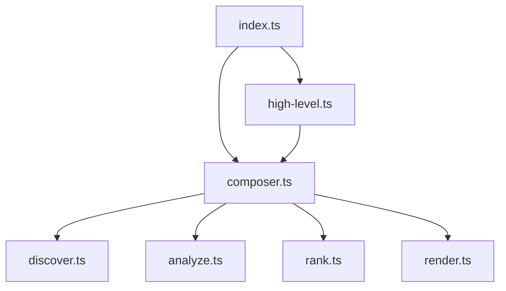

# Directory Structure
```
src/
  pipeline/
    analyze.ts
    discover.ts
    rank.ts
    render.ts
  tree-sitter/
    language-config.ts
    languages.ts
    queries.ts
  types/
    graphology-pagerank.d.ts
  utils/
    error.util.ts
    fs.util.ts
    logger.util.ts
  composer.ts
  high-level.ts
  index.ts
  types.ts
README.md
```

# Files

## File: src/utils/error.util.ts
````typescript
export class RepoGraphError extends Error {
  constructor(message: string, public readonly originalError?: unknown) {
    super(message);
    this.name = 'RepoGraphError';
    if (this.originalError instanceof Error && this.originalError.stack) {
      this.stack = `${this.stack}\nCaused by: ${this.originalError.stack}`;
    }
  }
}

export class FileSystemError extends RepoGraphError {
  constructor(message: string, public readonly path: string, originalError?: unknown) {
    super(`${message}: ${path}`, originalError);
    this.name = 'FileSystemError';
  }
}

export class ParserError extends RepoGraphError {
  constructor(message: string, public readonly language?: string, originalError?: unknown) {
    super(language ? `[${language}] ${message}` : message, originalError);
    this.name = 'ParserError';
  }
}
````

## File: src/utils/fs.util.ts
````typescript
import fs from 'node:fs/promises';
import path from 'node:path';
import { FileSystemError } from './error.util.js';

export const readFile = async (filePath: string): Promise<string> => {
  try {
    const buffer = await fs.readFile(filePath);
    // A simple heuristic to filter out binary files is checking for a null byte.
    if (buffer.includes(0)) {
      throw new FileSystemError('File appears to be binary', filePath);
    }
    return buffer.toString('utf-8');
  } catch (e) {
    if (e instanceof FileSystemError) {
      throw e;
    }
    throw new FileSystemError('Failed to read file', filePath, e);
  }
};

export const writeFile = async (filePath: string, content: string): Promise<void> => {
  try {
    await fs.mkdir(path.dirname(filePath), { recursive: true });
    await fs.writeFile(filePath, content);
  } catch (e) {
    throw new FileSystemError('Failed to write file', filePath, e);
  }
};

export const isDirectory = async (filePath: string): Promise<boolean> => {
  try {
    const stats = await fs.stat(filePath);
    return stats.isDirectory();
  } catch (e) {
    if (e && typeof e === 'object' && 'code' in e && e.code === 'ENOENT') {
      return false;
    }
    throw new FileSystemError('Failed to check if path is a directory', filePath, e);
  }
};
````

## File: src/types/graphology-pagerank.d.ts
````typescript
declare module 'graphology-pagerank' {
  import type Graph from 'graphology';

  export default function pagerank<T = any>(graph: Graph<T>, options?: {
    alpha?: number;
    tolerance?: number;
    maxIterations?: number;
    getEdgeWeight?: (edge: string) => number;
  }): Record<string, number>;
}
````

## File: src/utils/logger.util.ts
````typescript
export const LogLevels = {
  silent: 0,
  error: 1,
  warn: 2,
  info: 3,
  debug: 4,
} as const;

export type LogLevel = keyof typeof LogLevels;

// This state is internal to the logger module.
let currentLevel: LogLevel = 'info';

const logFunctions: Record<Exclude<LogLevel, 'silent'>, (...args: any[]) => void> = {
  error: console.error,
  warn: console.warn,
  info: console.log, // Use console.log for info for cleaner output
  debug: console.debug,
};

const log = (level: LogLevel, ...args: any[]): void => {
  if (level === 'silent' || LogLevels[level] > LogLevels[currentLevel]) {
    return;
  }

  logFunctions[level](...args);
};

export type Logger = {
  readonly error: (...args: any[]) => void;
  readonly warn: (...args: any[]) => void;
  readonly info: (...args: any[]) => void;
  readonly debug: (...args: any[]) => void;
  readonly setLevel: (level: LogLevel) => void;
  readonly getLevel: () => LogLevel;
};

const createLogger = (): Logger => {
  return Object.freeze({
    error: (...args: any[]) => log('error', ...args),
    warn: (...args: any[]) => log('warn', ...args),
    info: (...args: any[]) => log('info', ...args),
    debug: (...args: any[]) => log('debug', ...args),
    setLevel: (level: LogLevel) => {
      if (level in LogLevels) {
        currentLevel = level;
      }
    },
    getLevel: () => currentLevel,
  });
};

export const logger = createLogger();
````

## File: src/tree-sitter/language-config.ts
````typescript
import type { Language } from 'web-tree-sitter';

export interface LanguageConfig {
  name: string;
  extensions: string[];
  wasmPath: string;
  query: string;
}

export interface LoadedLanguage {
  config: LanguageConfig;
  language: Language;
}

export const LANGUAGE_CONFIGS: LanguageConfig[] = [
  {
    name: 'typescript',
    extensions: ['.ts', '.js', '.mjs', '.cjs'],
    wasmPath: 'tree-sitter-typescript/tree-sitter-typescript.wasm',
    query: `
(import_statement
  source: (string) @import.source) @import.statement

(class_declaration) @class.definition
(export_statement declaration: (class_declaration)) @class.definition

(function_declaration) @function.definition
(export_statement declaration: (function_declaration)) @function.definition

(variable_declarator value: (arrow_function)) @function.arrow.definition
(public_field_definition value: (arrow_function)) @function.arrow.definition
(export_statement declaration: (lexical_declaration (variable_declarator value: (arrow_function)))) @function.arrow.definition

(interface_declaration) @interface.definition
(export_statement declaration: (interface_declaration)) @interface.definition

(type_alias_declaration) @type.definition
(export_statement declaration: (type_alias_declaration)) @type.definition

(enum_declaration) @enum.definition
(export_statement declaration: (enum_declaration)) @enum.definition

(method_definition) @method.definition
(public_field_definition) @field.definition

(variable_declarator) @variable.definition
(export_statement declaration: (lexical_declaration (variable_declarator))) @variable.definition

(call_expression
  function: (identifier) @function.call)

; Class inheritance and implementation patterns
(extends_clause (identifier) @class.inheritance)
(implements_clause (type_identifier) @class.implementation)
`
  },
  {
    name: 'tsx',
    extensions: ['.tsx', '.jsx'],
    wasmPath: 'tree-sitter-typescript/tree-sitter-tsx.wasm',
    query: `
      (import_statement source: (string) @import.source) @import.statement
      (class_declaration) @class.definition
      (export_statement declaration: (class_declaration)) @class.definition
      (function_declaration) @function.definition
      (export_statement declaration: (function_declaration)) @function.definition
      (variable_declarator value: (arrow_function)) @function.arrow.definition
      (public_field_definition value: (arrow_function)) @function.arrow.definition
      (interface_declaration) @interface.definition
      (export_statement declaration: (interface_declaration)) @interface.definition
      (type_alias_declaration) @type.definition
      (export_statement declaration: (type_alias_declaration)) @type.definition
      (enum_declaration) @enum.definition
      (export_statement declaration: (enum_declaration)) @enum.definition
      (method_definition) @method.definition
      (public_field_definition) @field.definition
      
      ; Class inheritance and implementation patterns
      (extends_clause (identifier) @class.inheritance)
      (implements_clause (type_identifier) @class.implementation)
    `
  },
  {
    name: 'python',
    extensions: ['.py', '.pyw'],
    wasmPath: 'tree-sitter-python/tree-sitter-python.wasm',
    query: `
(import_statement) @import.statement
(import_from_statement
  module_name: (relative_import) @import.source) @import.statement
(import_from_statement
  module_name: (dotted_name) @import.source) @import.statement

(class_definition) @class.definition

(function_definition) @function.definition

(decorated_definition
  (function_definition)) @function.definition

(decorated_definition
  (class_definition)) @class.definition

(class_definition
  body: (block (function_definition) @method.definition))

(expression_statement
  (assignment)) @variable.definition

; Python inheritance patterns
(class_definition
  superclasses: (argument_list (identifier) @class.inheritance))
`
  },
  {
    name: 'java',
    extensions: ['.java'],
    wasmPath: 'tree-sitter-java/tree-sitter-java.wasm',
    query: `
(import_declaration
  (scoped_identifier) @import.source) @import.statement

(class_declaration) @class.definition
(interface_declaration) @interface.definition
(enum_declaration) @enum.definition

(method_declaration) @method.definition
(constructor_declaration) @constructor.definition

(field_declaration) @field.definition

; Java inheritance and implementation patterns
(superclass (type_identifier) @class.inheritance)
(super_interfaces (type_list (type_identifier) @class.implementation))

`
  },
  {
    name: 'cpp',
    extensions: ['.cpp', '.cc', '.cxx', '.h', '.hpp', '.hh', '.hxx'],
    wasmPath: 'tree-sitter-cpp/tree-sitter-cpp.wasm',
    query: `
(preproc_include) @import.statement

(function_definition) @function.definition
(declaration
  declarator: (function_declarator)) @function.declaration

(class_specifier) @class.definition
(struct_specifier) @struct.definition
(union_specifier) @union.definition
(enum_specifier) @enum.definition

(namespace_definition) @namespace.definition

(template_declaration) @template.definition

(function_definition declarator: (qualified_identifier)) @method.definition
(field_declaration declarator: (function_declarator)) @method.definition
(field_declaration) @field.definition
`
  },
  {
    name: 'c',
    extensions: ['.c'],
    wasmPath: 'tree-sitter-c/tree-sitter-c.wasm',
    query: `
(preproc_include) @import.statement

(function_definition) @function.definition
(declaration declarator: (function_declarator)) @function.declaration
(struct_specifier) @struct.definition
(union_specifier) @union.definition
(enum_specifier) @enum.definition
(type_definition) @type.definition
`
  },
  {
    name: 'go',
    extensions: ['.go'],
    wasmPath: 'tree-sitter-go/tree-sitter-go.wasm',
    query: `
(import_declaration) @import.statement

(function_declaration) @function.definition
(method_declaration) @method.definition

(type_declaration) @type.definition

(var_declaration) @variable.definition
(const_declaration) @constant.definition
`
  },
  {
    name: 'rust',
    extensions: ['.rs'],
    wasmPath: 'tree-sitter-rust/tree-sitter-rust.wasm',
    query: `
(mod_item
  name: (identifier) @import.source) @import.statement

(function_item) @function.definition
(impl_item) @impl.definition

(struct_item) @struct.definition
(enum_item) @enum.definition
(trait_item) @trait.definition
(function_signature_item) @method.definition

(type_item) @type.definition
(const_item) @constant.definition
(static_item) @static.definition

(function_signature_item) @function.declaration
`
  },
  {
    name: 'csharp',
    extensions: ['.cs'],
    wasmPath: 'tree-sitter-c-sharp/tree-sitter-c_sharp.wasm',
    query: `
(using_directive) @import.statement

(class_declaration) @class.definition
(interface_declaration) @interface.definition
(struct_declaration) @struct.definition
(enum_declaration) @enum.definition

(method_declaration) @method.definition
(constructor_declaration) @constructor.definition

(field_declaration) @field.definition
(property_declaration) @property.definition

(namespace_declaration) @namespace.definition
`
  },
  {
    name: 'php',
    extensions: ['.php'],
    wasmPath: 'tree-sitter-php/tree-sitter-php.wasm',
    query: `
      (namespace_definition) @namespace.definition
      (class_declaration) @class.definition
      (function_definition) @function.definition
      (method_declaration) @method.definition
    `
  },
  {
    name: 'ruby',
    extensions: ['.rb'],
    wasmPath: 'tree-sitter-ruby/tree-sitter-ruby.wasm',
    query: `
      (module) @module.definition
      (class) @class.definition
      (method) @method.definition
      (singleton_method) @method.definition
    `
  },
  {
    name: 'solidity',
    extensions: ['.sol'],
    wasmPath: 'tree-sitter-solidity/tree-sitter-solidity.wasm',
    query: `
      (contract_declaration) @class.definition
      (function_definition) @function.definition
      (event_definition) @enum.definition
    `
  },
  {
    name: 'swift',
    extensions: ['.swift'],
    wasmPath: 'tree-sitter-swift/tree-sitter-swift.wasm',
    query: `
      (class_declaration) @class.definition
      (protocol_declaration) @trait.definition
      (function_declaration) @function.definition
      (protocol_function_declaration) @function.definition
      (property_declaration) @field.definition
    `
  },
  {
    name: 'vue',
    extensions: ['.vue'],
    wasmPath: 'tree-sitter-vue/tree-sitter-vue.wasm',
    query: `
      (script_element .
        [
          (lexical_declaration (variable_declarator)) @variable.definition
          (function_declaration) @function.definition
        ])
`
  }
];

/**
 * Get the language configuration for a given file extension
 */
export function getLanguageConfigForFile(filePath: string): LanguageConfig | null {
  const extension = filePath.substring(filePath.lastIndexOf('.'));
  
  for (const config of LANGUAGE_CONFIGS) {
    if (config.extensions.includes(extension)) {
      return config;
    }
  }
  
  return null;
}

/**
 * Get all supported file extensions
 */
export function getSupportedExtensions(): string[] {
  return LANGUAGE_CONFIGS.flatMap(config => config.extensions);
}
````

## File: README.md
````markdown
<div align="center">

<!-- TODO: Add a cool logo here -->
<!--  -->

# RepoGraph

### Your Codebase, Visualized & Understood.

**Generate rich, semantic, and interactive codemaps to navigate, analyze, and master any repository.**

[](https://www.npmjs.com/package/repograph)
[](./LICENSE)
[](https://github.com/your-username/repograph/actions)
[](http://makeapullrequest.com)

</div>

---

Ever felt lost in a new codebase? Struggled to see the big picture or find the most critical files? RepoGraph is your solution. It's a powerful command-line tool and library that analyzes your code, builds a dependency graph, ranks key files and symbols, and generates a beautiful, detailed Markdown report.

Whether you're onboarding new engineers, planning a large-scale refactor, or even providing context to an AI, RepoGraph gives you the map you need to navigate with confidence.

## ✨ Key Features & Benefits

| Feature | Benefit |
| :--- | :--- |
| **🧠 Multi-Language Semantic Analysis** | Uses **Tree-sitter** to parse your code with deep understanding, identifying not just files, but classes, functions, methods, and their relationships. |
| **⭐ Intelligent Ranking Algorithms** | Go beyond file names. Rank code by importance using **PageRank** (centrality) or **Git Hot-Spots** (change frequency) to immediately find what matters. |
| **🎨 Rich Markdown Reports** | Generates a comprehensive `repograph.md` file with a project overview, dependency graphs, ranked file lists, and detailed symbol breakdowns. |
| **📊 Automatic Mermaid.js Graphs** | Visualize your module dependencies with an automatically generated, easy-to-read Mermaid diagram right in your report. |
| **🧩 Composable Pipeline API** | A fully functional, composable API allows you to replace or extend any part of the pipeline: **Discover → Analyze → Rank → Render**. |
| **⚙️ Highly Configurable CLI** | Fine-tune your analysis and output with a rich set of command-line flags to include/ignore files, customize the report, and more. |

## 🚀 Why Use RepoGraph?

-   **Accelerate Onboarding:** Give new developers a guided tour of the codebase, highlighting the most important entry points and modules.
-   **Master Code Navigation:** Understand how components are interconnected, making it easier to trace logic and predict the impact of changes.
-   **Prioritize Refactoring:** Identify highly-central but frequently changed files—prime candidates for refactoring and stabilization.
-   **Enhance AI Context:** Feed a structured, ranked, and semantically-rich overview of your codebase to LLMs for vastly improved code generation, analysis, and Q&A.
-   **Streamline Architectural Reviews:** Get a high-level, data-driven view of your system's architecture to facilitate design discussions.

## 📸 Gallery: Example Output

Imagine running `repograph` on a small project. Here's a glimpse of the beautiful and insightful Markdown file it produces.

---

# RepoGraph

_Generated by RepoGraph on 2023-10-27T10:30:00.000Z_

## 🚀 Project Overview

This repository contains 25 nodes (5 files).

### Module Dependency Graph



### Top 5 Most Important Files

| Rank | File | Description |
| :--- | :--- | :--- |
| 1 | `src/pipeline/analyze.ts` | Key module in the architecture. |
| 2 | `src/index.ts` | Key module in the architecture. |
| 3 | `src/composer.ts` | Key module in the architecture. |
| 4 | `src/types.ts` | Key module in the architecture. |
| 5 | `src/pipeline/render.ts` | Key module in the architecture. |

---

## 📂 File & Symbol Breakdown

### [`src/pipeline/analyze.ts`](./src/pipeline/analyze.ts)

- **`function createTreeSitterAnalyzer`** - _L257_
  ```typescript
  export const createTreeSitterAnalyzer = (): Analyzer => {
  ```
- **`function processFileDefinitions`** - _L291_
  ```typescript
  function processFileDefinitions(
  ```
- **`function findEnclosingSymbolId`** (calls `parent`) - _L461_
  ```typescript
  function findEnclosingSymbolId(startNode: TSNode, file: FileContent, nodes: ReadonlyMap<string, CodeNode>): string | null {
  ```

---

## 📦 Installation

Install RepoGraph globally to use it as a CLI tool from anywhere on your system.

```bash
# Using npm
npm install -g repograph

# Using yarn
yarn global add repograph

# Using pnpm
pnpm add -g repograph
```

## 🛠️ Usage

### Command-Line Interface (CLI)

The CLI is the quickest way to get a codemap. Simply navigate to your project's root directory and run the command.

**Basic Usage**

```bash
# Analyze the current directory and create repograph.md
repograph
```

**Advanced Usage**

```bash
# Analyze a specific project, use the git-changes ranker, and customize the output
repograph ./my-cool-project \
  --output docs/CodeMap.md \
  --ranking-strategy git-changes \
  --ignore "**/__tests__/**" \
  --no-mermaid
```

#### All CLI Options

| Argument | Alias | Description | Default |
| :--- | :--- | :--- | :--- |
| `root` | | The root directory of the repository to analyze. | `.` |
| `--output <path>` | | Path to the output Markdown file. | `repograph.md` |
| `--include <pattern>` | | Glob pattern for files to include. Can be specified multiple times. | `**/*` |
| `--ignore <pattern>` | | Glob pattern for files to ignore. Can be specified multiple times. | |
| `--no-gitignore` | | Do not respect `.gitignore` files. | `false` |
| `--ranking-strategy <name>` | | Ranking strategy: `pagerank` or `git-changes`. | `pagerank` |
| `--log-level <level>` | | Logging level: `silent`, `error`, `warn`, `info`, `debug`. | `info` |
| `--help` | `-h` | Display the help message. | |
| `--version` | `-v` | Display the version number. | |
| **Output Formatting** | | | |
| `--no-header` | | Do not include the main "RepoGraph" header. | `false` |
| `--no-overview` | | Do not include the project overview section. | `false` |
| `--no-mermaid` | | Do not include the Mermaid dependency graph. | `false` |
| `--no-file-list` | | Do not include the list of top-ranked files. | `false` |
| `--no-symbol-details` | | Do not include the detailed file and symbol breakdown. | `false` |
| `--top-file-count <num>` | | Number of files in the top list. | `10` |
| `--file-section-separator <str>`| | Custom separator for file sections. | `---` |
| `--no-symbol-relations` | | Hide symbol relationship details (e.g., `calls`). | `false` |
| `--no-symbol-line-numbers` | | Hide line numbers for symbols. | `false` |
| `--no-symbol-snippets` | | Hide code snippets for symbols. | `false` |
| `--max-relations-to-show <num>`| | Max number of 'calls' relations to show per symbol. | `3` |

### 📚 Programmatic API

For ultimate flexibility, use the RepoGraph programmatic API. Integrate it into your own tools, build custom pipelines, and invent new ways to analyze code.

#### High-Level API (`generateMap`)

The easiest way to get started. It uses the default, battle-tested pipeline.

```typescript
// my-script.ts
import { generateMap } from 'repograph';
import path from 'node:path';

await generateMap({
  root: path.resolve('./path/to/your/project'),
  output: 'my-custom-report.md',
  rankingStrategy: 'git-changes',
  rendererOptions: {
    includeMermaidGraph: false,
    topFileCount: 20,
    symbolDetailOptions: {
      includeCodeSnippet: false,
    },
  },
});

console.log('✅ Report generated!');
```

#### Low-Level API (`createMapGenerator`)

Unleash the full power of RepoGraph's composable architecture. Swap out any part of the pipeline with your own implementation, and get the raw data back for custom processing.

In this example, we'll create a custom ranker that scores files based on line count, get the data back, and perform our own analysis before writing the report to a file.

```typescript
// my-advanced-script.ts
import {
  createMapGenerator,
  createDefaultDiscoverer,
  createTreeSitterAnalyzer,
  createMarkdownRenderer,
} from 'repograph';
import type { Ranker, CodeGraph, RankedCodeGraph, RepoGraphMap } from 'repograph';
import fs from 'node:fs/promises';

// 1. Define our custom ranker
const createLineCountRanker = (): Ranker => {
  return async (graph: CodeGraph): Promise<RankedCodeGraph> => {
    const ranks = new Map<string, number>();
    for (const [id, node] of graph.nodes) {
      // We only rank file nodes with this strategy
      if (node.type === 'file') {
        const lineCount = node.endLine - node.startLine;
        ranks.set(id, lineCount); // Simple score: more lines = higher rank
      } else {
        ranks.set(id, 0);
      }
    }
    // Normalize ranks between 0 and 1
    const maxRank = Math.max(...ranks.values(), 1);
    for (const [id, rank] of ranks.entries()) {
      ranks.set(id, rank / maxRank);
    }
    return { ...graph, ranks };
  };
};

// 2. Compose the pipeline with our custom ranker
const myCustomGenerator = createMapGenerator({
  discover: createDefaultDiscoverer(),
  analyze: createTreeSitterAnalyzer(),
  rank: createLineCountRanker(), // <-- Use our custom ranker here!
  render: createMarkdownRenderer(),
});

// 3. Run the generator to get the map object
const map: RepoGraphMap = await myCustomGenerator({
  root: './path/to/your/project',
  // By omitting 'output', the result is returned instead of written to a file.
});

// 4. Now you have full control over the output
console.log(`Generated map with ${map.graph.nodes.size} nodes.`);
console.log('Top 3 files by line count:');
[...map.graph.nodes.values()]
  .filter(n => n.type === 'file')
  .sort((a, b) => (map.graph.ranks.get(b.id) ?? 0) - (map.graph.ranks.get(a.id) ?? 0))
  .slice(0, 3)
  .forEach((file, i) => {
    console.log(`  ${i + 1}. ${file.filePath}`);
  });

// You can still write the markdown to a file if you want
await fs.writeFile('line-count-report.md', map.markdown);
console.log('✅ Custom report generated and saved!');
```

## 🔬 The RepoGraph Pipeline

RepoGraph processes your code in four distinct, composable stages:

1.  **`🔍 Discover`**
    -   Scans the filesystem using glob patterns.
    -   Respects `.gitignore` and custom ignore rules.
    -   Reads all matching files into memory.

2.  **`🧠 Analyze`**
    -   Groups files by language and parses them using **Tree-sitter**.
    -   Executes language-specific queries to find symbol definitions (classes, functions, etc.) and relationships (imports, calls, inheritance).
    -   Builds the core `CodeGraph` of nodes and edges.

3.  **`⭐ Rank`**
    -   Takes the `CodeGraph` as input.
    -   Applies a ranking algorithm (like PageRank) to assign a score to every node in the graph.
    -   Produces a `RankedCodeGraph`.

4.  **`🎨 Render`**
    -   Receives the `RankedCodeGraph` and rendering options.
    -   Generates the final, human-readable Markdown output, including the summary, Mermaid graph, and detailed breakdowns.

## 🌐 Supported Languages

Thanks to Tree-sitter, RepoGraph has robust support for a wide array of popular languages:

-   TypeScript / JavaScript (including JSX/TSX)
-   Python
-   Java
-   Go
-   Rust
-   C / C++
-   C#
-   PHP
-   Ruby
-   Solidity
-   Swift
-   Vue

*Support for more languages is on the roadmap!*

## 🙌 Contributing

Contributions are welcome! Whether you're fixing a bug, adding a feature, or improving documentation, your help is appreciated.

1.  Fork the repository.
2.  Create your feature branch (`git checkout -b feature/AmazingFeature`).
3.  Make your changes.
4.  Commit your changes (`git commit -m 'Add some AmazingFeature'`).
5.  Push to the branch (`git push origin feature/AmazingFeature`).
6.  Open a Pull Request.

The project uses `bun` for development, `eslint` for linting, and `prettier` for formatting. Please ensure your contributions adhere to the existing code style.

## 📜 License

This project is licensed under the **MIT License**. See the [LICENSE](./LICENSE) file for details.
````

## File: src/tree-sitter/languages.ts
````typescript
import * as Parser from 'web-tree-sitter';
import path from 'node:path';
import { fileURLToPath } from 'node:url';
import { LANGUAGE_CONFIGS, type LanguageConfig, type LoadedLanguage } from './language-config.js';
import { logger } from '../utils/logger.util.js';
import { ParserError } from '../utils/error.util.js';

// Helper to get the correct path in different environments
const getDirname = () => path.dirname(fileURLToPath(import.meta.url));

let isInitialized = false;
const loadedLanguages = new Map<string, LoadedLanguage>();

/**
 * Initializes the Tree-sitter parser system.
 * This function is idempotent.
 */
export const initializeParser = async (): Promise<void> => {
  if (isInitialized) {
    return;
  }

  await Parser.Parser.init();
  isInitialized = true;
};

/**
 * Loads a specific language grammar.
 * @param config The language configuration to load
 * @returns A LoadedLanguage object containing the config and language
 */
export const loadLanguage = async (config: LanguageConfig): Promise<LoadedLanguage> => {
  if (loadedLanguages.has(config.name)) {
    return loadedLanguages.get(config.name)!;
  }

  await initializeParser();

  try {
    const wasmPath = path.resolve(getDirname(), '..', '..', 'node_modules', config.wasmPath);
    const language = await Parser.Language.load(wasmPath);
    
    const loadedLanguage: LoadedLanguage = {
      config,
      language
    };
    
    loadedLanguages.set(config.name, loadedLanguage);
    return loadedLanguage;
  } catch (error) {
    const message = `Failed to load Tree-sitter WASM file for ${config.name}. Please ensure '${config.wasmPath.split('/')[0]}' is installed.`;
    logger.error(message, error);
    throw new ParserError(message, config.name, error);
  }
};

/**
 * Creates a parser instance for a specific language.
 * @param config The language configuration
 * @returns A parser instance configured for the specified language
 */
export const createParserForLanguage = async (config: LanguageConfig): Promise<Parser.Parser> => {
  const loadedLanguage = await loadLanguage(config);
  const parser = new Parser.Parser();
  parser.setLanguage(loadedLanguage.language);
  return parser;
};

/**
 * Gets all loaded languages.
 * @returns A map of language names to LoadedLanguage objects
 */
export const getLoadedLanguages = (): Map<string, LoadedLanguage> => {
  return new Map(loadedLanguages);
};

/**
 * Preloads all supported languages.
 * This can be called to eagerly load all language parsers.
 */
export const preloadAllLanguages = async (): Promise<void> => {
  await Promise.all(LANGUAGE_CONFIGS.map(config => loadLanguage(config)));
};

// Legacy function for backward compatibility
export const getParser = async (): Promise<Parser.Parser> => {
  const tsConfig = LANGUAGE_CONFIGS.find(config => config.name === 'typescript');
  if (!tsConfig) {
    throw new Error('TypeScript configuration not found');
  }
  return createParserForLanguage(tsConfig);
};
````

## File: src/high-level.ts
````typescript
import { createMapGenerator } from './composer.js';
import { createDefaultDiscoverer } from './pipeline/discover.js';
import { createTreeSitterAnalyzer } from './pipeline/analyze.js';
import { createPageRanker, createGitRanker } from './pipeline/rank.js';
import { createMarkdownRenderer } from './pipeline/render.js';
import type { RepoGraphOptions, Ranker } from './types.js';
import path from 'node:path';
import { logger } from './utils/logger.util.js';

/**
 * The primary, easy-to-use entry point for RepoGraph. It orchestrates the
 * default pipeline based on a configuration object to generate a codemap.
 *
 * @param options The configuration object for generating the map.
 */
export const generateMap = async (options: RepoGraphOptions = {}): Promise<void> => {
  const {
    root = process.cwd(),
    output = './repograph.md',
    rankingStrategy = 'pagerank',
    logLevel = 'info',
  } = options;

  if (logLevel) {
    logger.setLevel(logLevel);
  }

  let ranker: Ranker;
  if (rankingStrategy === 'git-changes') {
    ranker = createGitRanker();
  } else if (rankingStrategy === 'pagerank') {
    ranker = createPageRanker();
  } else {
    throw new Error(`Invalid ranking strategy: '${rankingStrategy}'. Available options are 'pagerank', 'git-changes'.`);
  }

  const generator = createMapGenerator({
    discover: createDefaultDiscoverer(),
    analyze: createTreeSitterAnalyzer(),
    rank: ranker,
    render: createMarkdownRenderer(),
  });

  await generator({
    root: path.resolve(root),
    output: output,
    include: options.include,
    ignore: options.ignore,
    noGitignore: options.noGitignore,
    rendererOptions: options.rendererOptions,
  });
};
````

## File: src/tree-sitter/queries.ts
````typescript
import { LANGUAGE_CONFIGS, getLanguageConfigForFile, type LanguageConfig } from './language-config.js';

/**
 * Tree-sitter query for TypeScript and JavaScript to capture key symbols.
 * This query is designed to find definitions of classes, functions, interfaces,
 * and import statements to build the code graph.
 * 
 * @deprecated Use getQueryForLanguage() instead
 */
export const TS_QUERY = `
(import_statement
  source: (string) @import.source) @import.statement

(class_declaration) @class.definition
(export_statement declaration: (class_declaration)) @class.definition

(function_declaration) @function.definition
(export_statement declaration: (function_declaration)) @function.definition

(variable_declarator value: (arrow_function)) @function.arrow.definition
(public_field_definition value: (arrow_function)) @function.arrow.definition
(export_statement declaration: (lexical_declaration (variable_declarator value: (arrow_function)))) @function.arrow.definition

(interface_declaration) @interface.definition
(export_statement declaration: (interface_declaration)) @interface.definition

(type_alias_declaration) @type.definition
(export_statement declaration: (type_alias_declaration)) @type.definition

(method_definition) @method.definition
(public_field_definition) @field.definition

(call_expression
  function: (identifier) @function.call)
`;

/**
 * Get the Tree-sitter query for a specific language configuration.
 * @param config The language configuration
 * @returns The query string for the language
 */
export function getQueryForLanguage(config: LanguageConfig): string {
  return config.query.trim();
}

/**
 * Get the Tree-sitter query for a file based on its extension.
 * @param filePath The file path
 * @returns The query string for the file's language, or null if not supported
 */
export function getQueryForFile(filePath: string): string | null {
  const config = getLanguageConfigForFile(filePath);
  return config ? getQueryForLanguage(config) : null;
}

/**
 * Get all supported language configurations.
 * @returns Array of all language configurations
 */
export function getAllLanguageConfigs(): LanguageConfig[] {
  return [...LANGUAGE_CONFIGS];
}
````

## File: src/pipeline/render.ts
````typescript
import type { Renderer, RankedCodeGraph, RendererOptions, CodeEdge, CodeNode } from '../types.js';

const generateMermaidGraph = (rankedGraph: RankedCodeGraph): string => {
  const fileNodes = [...rankedGraph.nodes.values()].filter(node => node.type === 'file');
  if (fileNodes.length === 0) return '';

  let mermaidString = '```mermaid\n';
  mermaidString += 'graph TD\n';
  
  const edges = new Set<string>();
  for (const edge of rankedGraph.edges) {
      const sourceNode = rankedGraph.nodes.get(edge.fromId);
      const targetNode = rankedGraph.nodes.get(edge.toId);

      if(sourceNode?.type === 'file' && targetNode?.type === 'file' && edge.type === 'imports'){
        const edgeStr = `    ${edge.fromId}["${sourceNode.name}"] --> ${edge.toId}["${targetNode.name}"]`;
        if(!edges.has(edgeStr)) {
            edges.add(edgeStr);
        }
      }
  }

  mermaidString += Array.from(edges).join('\n');
  mermaidString += '\n```\n';
  return mermaidString;
};

const getRank = (id: string, ranks: ReadonlyMap<string, number>): number => ranks.get(id) || 0;

const buildRelationString = (
  label: string,
  edges: readonly CodeEdge[],
  allNodes: ReadonlyMap<string, CodeNode>,
  limit?: number
): string | null => {
  const names = edges.map(e => `\`${allNodes.get(e.toId)?.name ?? 'unknown'}\``);
  if (names.length === 0) return null;
  
  let displayNames = names;
  let suffix = '';
  if (limit && names.length > limit) {
      displayNames = names.slice(0, limit);
      suffix = '...';
  }
  
  return `${label} ${displayNames.join(', ')}${suffix}`;
};

/**
 * Creates the default Markdown renderer. It generates a summary, an optional
 * Mermaid diagram, and a detailed breakdown of files and symbols.
 * @returns A Renderer function.
 */
export const createMarkdownRenderer = (): Renderer => {
  return (rankedGraph: RankedCodeGraph, options: RendererOptions = {}) => { // NOSONAR
    const { nodes, ranks } = rankedGraph;
    const {
      customHeader,
      includeHeader = true,
      includeOverview = true,
      includeMermaidGraph = true,
      includeFileList = true,
      topFileCount = 10,
      includeSymbolDetails = true,
      fileSectionSeparator = '---',
      symbolDetailOptions,
    } = options;
    
    const {
      includeRelations = true,
      includeLineNumber = true,
      includeCodeSnippet = true,
      maxRelationsToShow = 3,
    } = symbolDetailOptions || {};

    const fileNodes = [...nodes.values()].filter(attrs => attrs.type === 'file');
    const sortedFiles = fileNodes
      .sort((a, b) => getRank(b.id, ranks) - getRank(a.id, ranks));

    let md = '';
    if (customHeader) {
      md += `${customHeader}\n\n`;
    } else if (includeHeader) {
      md += `# RepoGraph\n\n`;
      md += `_Generated by RepoGraph on ${new Date().toISOString()}_\n\n`;
    }

    if (includeOverview) {
      md += `## 🚀 Project Overview\n\n`;
      md += `This repository contains ${nodes.size} nodes (${sortedFiles.length} files).\n\n`;
    }

    if (includeMermaidGraph) {
      md += `### Module Dependency Graph\n\n`;
      md += generateMermaidGraph(rankedGraph);
    }
    
    if (includeFileList && sortedFiles.length > 0) {
      md += `### Top ${topFileCount} Most Important Files\n\n`;
      md += `| Rank | File | Description |\n`;
      md += `| :--- | :--- | :--- |\n`;
      sortedFiles.slice(0, topFileCount).forEach((file, i) => {
        md += `| ${i + 1} | \`${file.filePath}\` | Key module in the architecture. |\n`;
      });
      md += `\n${fileSectionSeparator}\n\n`;
    }

    if (includeSymbolDetails) {
      md += `## 📂 File & Symbol Breakdown\n\n`;
      for (const fileNode of sortedFiles) {
        md += `### [\`${fileNode.filePath}\`](./${fileNode.filePath})\n\n`;
        
        const symbolNodes = [...nodes.values()]
          .filter(node => node.filePath === fileNode.filePath && node.type !== 'file')
          .sort((a, b) => a.startLine - b.startLine);

        if (symbolNodes.length > 0) {
          for (const symbol of symbolNodes) {
            const detailParts: string[] = [];
            if (includeRelations) {
              const outgoingEdges = rankedGraph.edges.filter(e => e.fromId === symbol.id);
              if (outgoingEdges.length > 0) {
                const edgeGroups = outgoingEdges.reduce((acc, edge) => {
                  (acc[edge.type] = acc[edge.type] || []).push(edge);
                  return acc;
                }, {} as Record<CodeEdge['type'], CodeEdge[]>);
                
                const relationParts = [
                  buildRelationString('inherits', edgeGroups.inherits || [], nodes),
                  buildRelationString('implements', edgeGroups.implements || [], nodes),
                  buildRelationString('calls', edgeGroups.calls || [], nodes, maxRelationsToShow),
                ].filter((s): s is string => s !== null);
                if (relationParts.length > 0) detailParts.push(`(${relationParts.join('; ')})`);
              }
            }
            if (includeLineNumber) {
              detailParts.push(`- _L${symbol.startLine}_`);
            }

            md += `- **\`${symbol.type} ${symbol.name}\`**${detailParts.length > 0 ? ` ${detailParts.join(' ')}` : ''}\n`;
            
            if (includeCodeSnippet && symbol.codeSnippet) {
              // Use language from file extension for syntax highlighting if possible
              const lang = fileNode.language || fileNode.filePath.split('.').pop() || '';
              md += `  \`\`\`${lang}\n  ${symbol.codeSnippet}\n  \`\`\`\n`;
            }
          }
        } else {
            md += `_No symbols identified in this file._\n`
        }
        md += `\n${fileSectionSeparator}\n\n`;
      }
    }

    return md;
  };
};
````

## File: src/composer.ts
````typescript
import path from 'node:path';
import type { Analyzer, FileDiscoverer, Ranker, Renderer, RepoGraphMap } from './types.js';
import { logger } from './utils/logger.util.js';
import { writeFile } from './utils/fs.util.js';

type MapGenerator = (config: {
  readonly root: string;
  readonly output?: string;
  readonly include?: readonly string[];
  readonly ignore?: readonly string[];
  readonly noGitignore?: boolean;
  readonly rendererOptions?: any;
}) => Promise<RepoGraphMap>;

/**
 * A Higher-Order Function that takes pipeline functions as arguments and
 * returns a fully configured `generate` function for creating a codemap.
 * This is the core of RepoGraph's composability.
 *
 * @param pipeline An object containing implementations for each pipeline stage.
 * @returns An asynchronous function to generate and write the codemap.
 */
export const createMapGenerator = (pipeline: {
  readonly discover: FileDiscoverer;
  readonly analyze: Analyzer;
  readonly rank: Ranker;
  readonly render: Renderer;
}): MapGenerator => {
  if (
    !pipeline ||
    typeof pipeline.discover !== 'function' ||
    typeof pipeline.analyze !== 'function' ||
    typeof pipeline.rank !== 'function' ||
    typeof pipeline.render !== 'function'
  ) {
    throw new Error('createMapGenerator: A valid pipeline object with discover, analyze, rank, and render functions must be provided.');
  }

  return async (config) => {
    const { root, output, include, ignore, noGitignore, rendererOptions } = config;

    try {
      logger.info('1/4 Discovering files...');
      const files = await pipeline.discover({ root, include, ignore, noGitignore });
      logger.info(`  -> Found ${files.length} files to analyze.`);

      try {
        logger.info('2/4 Analyzing code and building graph...');
        const graph = await pipeline.analyze(files);
        logger.info(`  -> Built graph with ${graph.nodes.size} nodes and ${graph.edges.length} edges.`);

        try {
          logger.info('3/4 Ranking graph nodes...');
          const rankedGraph = await pipeline.rank(graph);
          logger.info('  -> Ranking complete.');

          try {
            logger.info('4/4 Rendering output...');
            const markdown = pipeline.render(rankedGraph, rendererOptions);
            logger.info('  -> Rendering complete.');

            if (output) {
              const outputPath = path.isAbsolute(output) ? output : path.resolve(root, output);
              logger.info(`Writing report to ${path.relative(process.cwd(), outputPath)}...`);
              await writeFile(outputPath, markdown);
              logger.info('  -> Report saved.');
            }

            return { graph: rankedGraph, markdown };
          } catch (error) {
            throw new Error(`Error in render stage: ${error instanceof Error ? error.message : String(error)}`);
          }
        } catch (error) {
          if (error instanceof Error && error.message.startsWith('Error in render stage:')) {
            throw error;
          }
          throw new Error(`Error in rank stage: ${error instanceof Error ? error.message : String(error)}`);
        }
      } catch (error) {
        if (error instanceof Error && (error.message.startsWith('Error in rank stage:') || error.message.startsWith('Error in render stage:'))) {
          throw error;
        }
        throw new Error(`Error in analyze stage: ${error instanceof Error ? error.message : String(error)}`);
      }
    } catch (error) {
      if (error instanceof Error && (error.message.startsWith('Error in analyze stage:') || error.message.startsWith('Error in rank stage:') || error.message.startsWith('Error in render stage:'))) {
        throw error;
      }
      throw new Error(`Error in discover stage: ${error instanceof Error ? error.message : String(error)}`);
    }
  };
};
````

## File: src/pipeline/discover.ts
````typescript
import { globby } from 'globby';
import path from 'node:path';
import Ignore from 'ignore';
import type { FileContent, FileDiscoverer } from '../types.js';
import { isDirectory, readFile } from '../utils/fs.util.js';
import { FileSystemError } from '../utils/error.util.js';
import { logger } from '../utils/logger.util.js';

/**
 * Creates the default file discoverer. It uses globby to find all files,
 * respecting .gitignore patterns and custom include/exclude rules.
 * @returns A FileDiscoverer function.
 */
export const createDefaultDiscoverer = (): FileDiscoverer => {
  return async ({ root, include, ignore, noGitignore = false }) => {
    try {
      if (!(await isDirectory(root))) {
        throw new FileSystemError('Root path is not a directory or does not exist', root);
      }
    } catch (e) {
      throw e;
    }
    const patterns = include && include.length > 0 ? [...include] : ['**/*'];
    
    // Use the ignore package for proper gitignore handling
    const ignoreFilter = Ignore();
    
    // Always ignore node_modules and .git
    ignoreFilter.add('**/node_modules/**');
    ignoreFilter.add('**/.git/**');
    ignoreFilter.add('.gitignore');
    
    // Add .gitignore patterns if not disabled
    if (!noGitignore) {
      let gitignoreContent = '';
      try {
        gitignoreContent = await readFile(path.join(root, '.gitignore'));
      } catch {
        // .gitignore is optional, so we can ignore errors here.
      }
      if (gitignoreContent) {
        ignoreFilter.add(gitignoreContent);
      }
    }
    
    // Add user-specified ignore patterns
    if (ignore && ignore.length > 0) {
      ignoreFilter.add(ignore.join('\n'));
    }

    // Use globby to find all files matching the include patterns
    const relativePaths = await globby(patterns, {
      cwd: root,
      gitignore: false, // We handle gitignore patterns manually
      dot: true,
      absolute: false,
      followSymbolicLinks: false, // Disable to prevent infinite loops
      onlyFiles: true,
    });
    
    // Filter the paths using the ignore package
    const filteredPaths = relativePaths.filter(p => !ignoreFilter.ignores(p));

    const fileContents = await Promise.all(
      filteredPaths.map(async (relativePath): Promise<FileContent | null> => {
        try {
          const absolutePath = path.join(root, relativePath);
          const content = await readFile(absolutePath);
          return { path: relativePath, content };
        } catch (e) {
          logger.debug(`Skipping file that could not be read: ${relativePath}`, e instanceof Error ? e.message : e);
          return null;
        }
      })
    );

    return fileContents.filter((c): c is FileContent => c !== null);
  };
};
````

## File: src/index.ts
````typescript
#!/usr/bin/env bun

import { logger } from './utils/logger.util.js';
import { RepoGraphError } from './utils/error.util.js';
// High-Level API for simple use cases
import { generateMap as executeGenerateMap } from './high-level.js';
import type { RepoGraphOptions as IRepoGraphOptions } from './types.js';

export { generateMap } from './high-level.js';

// Low-Level API for composition and advanced use cases
export { createMapGenerator } from './composer.js';

// Default pipeline component factories
export { createDefaultDiscoverer } from './pipeline/discover.js';
export { createTreeSitterAnalyzer } from './pipeline/analyze.js';
export { createPageRanker, createGitRanker } from './pipeline/rank.js';
export { createMarkdownRenderer } from './pipeline/render.js';

// Core types for building custom components
export type {
  FileContent,
  CodeNode,
  CodeNodeType,
  CodeEdge,
  CodeGraph,
  RankedCodeGraph,
  RepoGraphMap,
  RepoGraphOptions,
  RendererOptions,
  FileDiscoverer,
  Analyzer,
  Ranker,
  Renderer,
} from './types.js';

// This section runs only when the script is executed directly from the CLI
import { fileURLToPath } from 'node:url';
import path from 'node:path';

const isRunningDirectly = () => {
  if (typeof process.argv[1] === 'undefined') return false;
  const runningFile = path.resolve(process.argv[1]);
  const currentFile = fileURLToPath(import.meta.url);
  return runningFile === currentFile;
};

if (isRunningDirectly()) {
  const args = process.argv.slice(2);

  if (args.includes('--help') || args.includes('-h')) {
    console.log(`
Usage: repograph [root] [options]

Arguments:
  root                     The root directory of the repository to analyze. Defaults to the current working directory.

Options:
  -h, --help               Display this help message.
  -v, --version            Display the version number.
  --output <path>          Path to the output Markdown file. (default: "repograph.md")
  --include <pattern>      Glob pattern for files to include. Can be specified multiple times.
  --ignore <pattern>       Glob pattern for files to ignore. Can be specified multiple times.
  --no-gitignore           Do not respect .gitignore files.
  --ranking-strategy <name> The ranking strategy to use. (default: "pagerank", options: "pagerank", "git-changes")
  --log-level <level>      Set the logging level. (default: "info", options: "silent", "error", "warn", "info", "debug")

Output Formatting:
  --no-header              Do not include the main "RepoGraph" header.
  --no-overview            Do not include the project overview section.
  --no-mermaid             Do not include the Mermaid dependency graph.
  --no-file-list           Do not include the list of top-ranked files.
  --no-symbol-details      Do not include the detailed file and symbol breakdown.
  --top-file-count <num>   Set the number of files in the top list. (default: 10)
  --file-section-separator <str> Custom separator for file sections. (default: "---")
  --no-symbol-relations    Hide symbol relationship details (e.g., calls, implements).
  --no-symbol-line-numbers Hide line numbers for symbols.
  --no-symbol-snippets     Hide code snippets for symbols.
  --max-relations-to-show <num> Max number of 'calls' relations to show per symbol. (default: 3)
    `);
    process.exit(0);
  }

  if (args.includes('--version') || args.includes('-v')) {
    // In a real app, you'd get this from package.json
    logger.info('0.1.0');
    process.exit(0);
  }

  // We need a mutable version of the options to build it from arguments.
  const options: {
    root?: string;
    output?: string;
    include?: readonly string[];
    ignore?: readonly string[];
    noGitignore?: boolean;
    rankingStrategy?: 'pagerank' | 'git-changes';
    logLevel?: IRepoGraphOptions['logLevel'];
    rendererOptions?: IRepoGraphOptions['rendererOptions'];
  } = {};
  const includePatterns: string[] = [];
  const ignorePatterns: string[] = [];
  // We need a mutable version of rendererOptions to build from CLI args
  const rendererOptions: {
    customHeader?: string;
    includeHeader?: boolean;
    includeOverview?: boolean;
    includeMermaidGraph?: boolean;
    includeFileList?: boolean;
    topFileCount?: number;
    includeSymbolDetails?: boolean;
    fileSectionSeparator?: string;
    symbolDetailOptions?: {
      includeRelations?: boolean;
      includeLineNumber?: boolean;
      includeCodeSnippet?: boolean;
      maxRelationsToShow?: number;
    };
  } = {};

  for (let i = 0; i < args.length; i++) {
    const arg = args[i];
    if (!arg) {
      continue;
    }
    switch (arg) {
      case '--output':
        options.output = args[++i];
        break;
      case '--include':
        includePatterns.push(args[++i] as string);
        break;
      case '--ignore':
        ignorePatterns.push(args[++i] as string);
        break;
      case '--no-gitignore':
        options.noGitignore = true;
        break;
      case '--ranking-strategy':
        options.rankingStrategy = args[++i] as IRepoGraphOptions['rankingStrategy'];
        break;
      case '--log-level':
        options.logLevel = args[++i] as IRepoGraphOptions['logLevel'];
        break;
      // --- Renderer Options ---
      case '--no-header':
        rendererOptions.includeHeader = false;
        break;
      case '--no-overview':
        rendererOptions.includeOverview = false;
        break;
      case '--no-mermaid':
        rendererOptions.includeMermaidGraph = false;
        break;
      case '--no-file-list':
        rendererOptions.includeFileList = false;
        break;
      case '--no-symbol-details':
        rendererOptions.includeSymbolDetails = false;
        break;
      case '--top-file-count':
        rendererOptions.topFileCount = parseInt(args[++i] as string, 10);
        break;
      case '--file-section-separator':
        rendererOptions.fileSectionSeparator = args[++i];
        break;
      case '--no-symbol-relations':
        rendererOptions.symbolDetailOptions = { ...(rendererOptions.symbolDetailOptions || {}), includeRelations: false };
        break;
      case '--no-symbol-line-numbers':
        rendererOptions.symbolDetailOptions = { ...(rendererOptions.symbolDetailOptions || {}), includeLineNumber: false };
        break;
      case '--no-symbol-snippets':
        rendererOptions.symbolDetailOptions = { ...(rendererOptions.symbolDetailOptions || {}), includeCodeSnippet: false };
        break;
      case '--max-relations-to-show':
        rendererOptions.symbolDetailOptions = { ...(rendererOptions.symbolDetailOptions || {}), maxRelationsToShow: parseInt(args[++i] as string, 10) };
        break;
      default:
        if (!arg.startsWith('-')) {
          options.root = arg;
        }
        break;
    }
  }

  if (includePatterns.length > 0) {
    options.include = includePatterns;
  }
  if (ignorePatterns.length > 0) {
    options.ignore = ignorePatterns;
  }
  if (Object.keys(rendererOptions).length > 0) {
    options.rendererOptions = rendererOptions;
  }

  const finalOutput = path.resolve(options.root || process.cwd(), options.output || 'repograph.md');

  logger.info(`Starting RepoGraph analysis for "${path.resolve(options.root || process.cwd())}"...`);
  executeGenerateMap(options)
    .then(() => {
      const relativePath = path.relative(process.cwd(), finalOutput);
      logger.info(`\n✅ Success! RepoGraph map saved to ${relativePath}`);
    })
    .catch((error: unknown) => {
      if (error instanceof RepoGraphError) {
        logger.error(`\n❌ Error generating RepoGraph map: ${error.message}`);
      } else {
        logger.error('\n❌ An unknown error occurred while generating the RepoGraph map.', error);
      }
      process.exit(1);
    });
}
````

## File: src/pipeline/rank.ts
````typescript
import pagerank from 'graphology-pagerank';
import type { CodeGraph, Ranker, RankedCodeGraph } from '../types.js';
import Graph from 'graphology';
import { execSync } from 'node:child_process';
import { logger } from '../utils/logger.util.js';

/**
 * Creates a ranker that uses the PageRank algorithm. Nodes that are heavily referenced by
 * other important nodes will receive a higher rank.
 * @returns A Ranker function.
 */
export const createPageRanker = (): Ranker => {
  return async (graph: CodeGraph): Promise<RankedCodeGraph> => {
    // PageRank can only be computed on graphs with nodes.
    if (graph.nodes.size === 0) {
      return { ...graph, ranks: new Map() };
    }

    // Pagerank lib requires a graphology instance.
    const simpleGraph = new Graph({ type: 'directed' });
    for (const [nodeId, node] of graph.nodes) {
      simpleGraph.addNode(nodeId, node);
    }
    for (const edge of graph.edges) {
      if (!simpleGraph.hasEdge(edge.fromId, edge.toId)) {
        simpleGraph.addDirectedEdge(edge.fromId, edge.toId);
      }
    }

    const graphForRank = simpleGraph;
    const ranksData = pagerank(graphForRank);
    const ranks = new Map<string, number>();
    for (const node in ranksData) {
      ranks.set(node, ranksData[node] ?? 0);
    }
    return { ...graph, ranks };
  };
};

/**
 * Creates a ranker based on Git commit history. Files changed more frequently are considered
 * more important. Requires Git to be installed.
 * @returns A Ranker function.
 */
export const createGitRanker = (options: { maxCommits?: number } = {}): Ranker => {
  return async (graph: CodeGraph): Promise<RankedCodeGraph> => {
    const { maxCommits = 500 } = options;
    const ranks = new Map<string, number>();

    if (graph.nodes.size === 0) {
      return { ...graph, ranks };
    }

    try {
      const command = `git log --max-count=${maxCommits} --name-only --pretty=format:`;
      const output = execSync(command, { encoding: 'utf-8' });
      const files = output.split('\n').filter(Boolean);

      const changeCounts: Record<string, number> = {};
      for (const file of files) {
        changeCounts[file] = (changeCounts[file] || 0) + 1;
      }

      const maxChanges = Math.max(...Object.values(changeCounts), 1);

      for (const [nodeId, attributes] of graph.nodes) {
        // We only rank file nodes with this strategy
        if (attributes.type === 'file') {
          const count = changeCounts[attributes.filePath] ?? 0;
          ranks.set(nodeId, count / maxChanges); // Normalize score
        } else {
          ranks.set(nodeId, 0);
        }
      }
    } catch (e) {
      // This is not a fatal error for the whole process, but this ranker cannot proceed.
      logger.warn('Failed to use \'git\' for ranking. Is git installed and is this a git repository? Returning 0 for all ranks.');
      for (const [nodeId] of graph.nodes) {
        ranks.set(nodeId, 0);
      }
    }

    return { ...graph, ranks };
  };
};
````

## File: src/types.ts
````typescript
// Core Data Structures

/** Represents a single file read from disk. Immutable. */
export type FileContent = {
  readonly path: string;
  readonly content: string;
};

/** The type of a symbol identified in the code. */
export type CodeNodeType =
  | 'file'
  | 'class'
  | 'function'
  | 'interface'
  | 'variable'
  | 'type'
  | 'arrow_function'
  | 'method'
  | 'field'
  | 'struct'
  | 'enum'
  | 'namespace'
  | 'trait'
  | 'impl'
  | 'constructor'
  | 'property'
  | 'constant'
  | 'static'
  | 'union'
  | 'template';

/** Represents a single, identifiable symbol (or a file) in the code. Immutable. */
export type CodeNode = {
  readonly id: string; // Unique identifier (e.g., 'src/api.ts#MyClass')
  readonly type: CodeNodeType;
  readonly name: string; // e.g., 'MyClass'
  readonly filePath: string;
  readonly startLine: number;
  readonly endLine: number;
  readonly language?: string; // For file nodes, the detected language
  readonly codeSnippet?: string; // e.g., function signature
};

/** Represents a directed relationship between two CodeNodes. Immutable. */
export type CodeEdge = {
  readonly fromId: string; // ID of the source CodeNode
  readonly toId: string;   // ID of the target CodeNode
  readonly type: 'imports' | 'calls' | 'inherits' | 'implements';
};

/** The complete, raw model of the repository's structure. Immutable. */
export type CodeGraph = {
  readonly nodes: ReadonlyMap<string, CodeNode>;
  readonly edges: readonly CodeEdge[];
};

/** A CodeGraph with an added 'rank' score for each node. Immutable. */
export type RankedCodeGraph = CodeGraph & {
  readonly ranks: ReadonlyMap<string, number>; // Key is CodeNode ID
};

/** The output of a map generation process, containing the graph and rendered output. */
export type RepoGraphMap = {
  readonly graph: RankedCodeGraph;
  readonly markdown: string;
};

// High-Level API Options

/** Configuration for the final Markdown output. */
export type RendererOptions = {
  /** Custom text to appear at the top of the Markdown file. Overrides `includeHeader`. */
  readonly customHeader?: string;
  /** Include the default `RepoGraph` header. @default true */
  readonly includeHeader?: boolean;
  /** Include the project overview section. @default true */
  readonly includeOverview?: boolean;
  /** Include a Mermaid.js dependency graph. @default true */
  readonly includeMermaidGraph?: boolean;
  /** Include the list of top-ranked files. @default true */
  readonly includeFileList?: boolean;
  /** Number of files to show in the top list. @default 10 */
  readonly topFileCount?: number;
  /** Include detailed breakdowns for each symbol. @default true */
  readonly includeSymbolDetails?: boolean;
  /** String to use as a separator between file sections. @default '---' */
  readonly fileSectionSeparator?: string;

  /** Options for how individual symbols are rendered */
  readonly symbolDetailOptions?: {
    /** Include relationships (calls, inherits, etc.) in the symbol line. @default true */
    readonly includeRelations?: boolean;
    /** Include the starting line number. @default true */
    readonly includeLineNumber?: boolean;
    /** Include the code snippet for the symbol. @default true */
    readonly includeCodeSnippet?: boolean;
    /** Max number of relations to show per type (e.g., 'calls'). @default 3 */
    readonly maxRelationsToShow?: number;
  };
};

/** Configuration options for the main `generateMap` function. */
export type RepoGraphOptions = {
  /** Root directory to analyze. @default process.cwd() */
  readonly root?: string;
  /** Output path for the Markdown file. @default './repograph.md' */
  readonly output?: string;
  /** Glob patterns for files to include. */
  readonly include?: readonly string[];
  /** Glob patterns for files to exclude. */
  readonly ignore?: readonly string[];
  /** Disables the use of .gitignore. @default false */
  readonly noGitignore?: boolean;
  /** The ranking strategy to use. @default 'pagerank' */
  readonly rankingStrategy?: 'pagerank' | 'git-changes';
  /** Configuration for the final Markdown output. */
  readonly rendererOptions?: RendererOptions;
  /** Logging level. @default 'info' */
  readonly logLevel?: 'silent' | 'error' | 'warn' | 'info' | 'debug';
};

// Low-Level Functional Pipeline Contracts

/** Discovers files and returns their content. */
export type FileDiscoverer = (config: {
  readonly root: string;
  readonly include?: readonly string[];
  readonly ignore?: readonly string[];
  readonly noGitignore?: boolean;
}) => Promise<readonly FileContent[]>;

/** Analyzes file content and builds the dependency graph. */
export type Analyzer = (files: readonly FileContent[]) => Promise<CodeGraph>;

/** Ranks the nodes in a graph. */
export type Ranker = (graph: CodeGraph) => Promise<RankedCodeGraph>;

/** Renders a ranked graph into a string format. */
export type Renderer = (rankedGraph: RankedCodeGraph, options?: RendererOptions) => string;
````

## File: src/pipeline/analyze.ts
````typescript
import path from 'node:path';
import { createParserForLanguage } from '../tree-sitter/languages.js';
import { getLanguageConfigForFile, type LanguageConfig } from '../tree-sitter/language-config.js';
import type { Analyzer, CodeNode, CodeNodeType, FileContent, CodeEdge } from '../types.js';
import type { Node as TSNode, QueryCapture as TSMatch } from 'web-tree-sitter';
import { logger } from '../utils/logger.util.js';
import { ParserError } from '../utils/error.util.js';

// --- UTILITY FUNCTIONS ---

const getNodeText = (node: TSNode, content: string): string => content.slice(node.startIndex, node.endIndex);
const getLineFromIndex = (content: string, index: number): number => content.substring(0, index).split('\n').length;

// --- LANGUAGE-SPECIFIC LOGIC ---

type LanguageHandler = {
  preProcessFile?: (file: FileContent, captures: TSMatch[]) => Record<string, any>;
  shouldSkipSymbol: (node: TSNode, symbolType: CodeNodeType, langName: string) => boolean;
  getSymbolNameNode: (declarationNode: TSNode, originalNode: TSNode) => TSNode | null;
  processComplexSymbol?: (context: ProcessSymbolContext) => boolean;
  resolveImport: (fromFile: string, importIdentifier: string, allFiles: string[]) => string | null;
};

type ProcessSymbolContext = {
  nodes: Map<string, CodeNode>;
  file: FileContent;
  node: TSNode;
  symbolType: CodeNodeType;
  processedSymbols: Set<string>;
  fileState: Record<string, any>;
};

const pythonHandler: Partial<LanguageHandler> = {
  getSymbolNameNode: (declarationNode: TSNode) => {
    if (declarationNode.type === 'expression_statement') {
      const assignmentNode = declarationNode.namedChild(0);
      if (assignmentNode?.type === 'assignment') {
        return assignmentNode.childForFieldName('left');
      }
    }
    return declarationNode.childForFieldName('name');
  },
};

const goLangHandler: Partial<LanguageHandler> = {
  getSymbolNameNode: (declarationNode: TSNode) => {
    const nodeType = declarationNode.type;
    if (['type_declaration', 'const_declaration', 'var_declaration'].includes(nodeType)) {
      const spec = declarationNode.namedChild(0);
      if (spec && ['type_spec', 'const_spec', 'var_spec'].includes(spec.type)) {
        return spec.childForFieldName('name');
      }
    }
    return declarationNode.childForFieldName('name');
  },
};

const cLangHandler: Partial<LanguageHandler> = {
  getSymbolNameNode: (declarationNode: TSNode) => {
    if (declarationNode.type === 'type_definition') {
      const lastChild = declarationNode.namedChild(declarationNode.namedChildCount - 1);
      if (lastChild?.type === 'type_identifier') return lastChild;
    }
    if (declarationNode.type === 'function_definition') {
      const declarator = declarationNode.childForFieldName('declarator');
      if (declarator?.type === 'function_declarator') {
        const nameNode = declarator.childForFieldName('declarator');
        if (nameNode?.type === 'identifier') return nameNode;
      }
    }
    if (declarationNode.type === 'field_declaration') {
      const declarator = declarationNode.childForFieldName('declarator');
      if (declarator?.type === 'function_declarator') {
        return declarator.childForFieldName('declarator');
      }
      return declarator;
    }
    return declarationNode.childForFieldName('name');
  },
};

const tsLangHandler: Partial<LanguageHandler> = {
  preProcessFile: (_file, captures) => {
    const classNames = new Map<string, number>();
    const duplicateClassNames = new Set<string>();
    const seenClassNodes = new Set<number>();

    for (const { name, node } of captures) {
      if (name === 'class.definition') {
        let classNode = node.type === 'export_statement' ? (node.namedChildren[0] ?? node) : node;
        if (classNode.type === 'class_declaration' && !seenClassNodes.has(classNode.startIndex)) {
          seenClassNodes.add(classNode.startIndex);
          const nameNode = classNode.childForFieldName('name');
          if (nameNode) {
            const className = nameNode.text;
            const count = classNames.get(className) || 0;
            classNames.set(className, count + 1);
            if (count + 1 > 1) duplicateClassNames.add(className);
          }
        }
      }
    }
    return { duplicateClassNames };
  },
  shouldSkipSymbol: (node, symbolType, langName) => {
    if (langName !== 'typescript') return false;
    const valueNode = node.childForFieldName('value');
    if (valueNode?.type !== 'arrow_function') return false;
    return (symbolType === 'field' && node.type === 'public_field_definition') ||
      (symbolType === 'variable' && node.type === 'variable_declarator');
  },
  getSymbolNameNode: (declarationNode, originalNode) => {
    if (originalNode.type === 'variable_declarator' || originalNode.type === 'public_field_definition') { // Arrow function
      return originalNode.childForFieldName('name');
    }
    if (declarationNode.type === 'export_statement') {
      const lexicalDecl = declarationNode.namedChildren[0];
      if (lexicalDecl?.type === 'lexical_declaration') {
        const varDeclarator = lexicalDecl.namedChildren[0];
        if (varDeclarator?.type === 'variable_declarator') {
          return varDeclarator.childForFieldName('name');
        }
      }
    }
    return declarationNode.childForFieldName('name');
  },
  processComplexSymbol: ({ nodes, file, node, symbolType, processedSymbols, fileState }) => {
    if (symbolType !== 'method' && symbolType !== 'field') return false;
    const classParent = node.parent?.parent; // class_body -> class_declaration
    if (classParent?.type === 'class_declaration') {
      const classNameNode = classParent.childForFieldName('name');
      if (classNameNode) {
        const className = classNameNode.text;
        const nameNode = node.childForFieldName('name');
        // The check for duplicateClassNames is important to avoid ambiguity.
        // We remove the dependency on checking if the class has been processed first,
        // because the order of captures from tree-sitter is not guaranteed to be in source order.
        // This makes the analysis more robust.
        if (nameNode && !fileState['duplicateClassNames']?.has(className)) {
          const methodName = nameNode.text;
          const symbolName = `${className}.${methodName}`;
          const symbolId = `${file.path}#${symbolName}`;
          if (!processedSymbols.has(symbolId) && !nodes.has(symbolId)) {
            processedSymbols.add(symbolId);
            nodes.set(symbolId, {
              id: symbolId, type: symbolType, name: symbolName, filePath: file.path,
              startLine: getLineFromIndex(file.content, node.startIndex),
              endLine: getLineFromIndex(file.content, node.endIndex),
              codeSnippet: node.text?.split('{')[0]?.trim() || '',
            });
          }
        }
      }
    }
    return true;
  },
};

const resolveImportFactory = (endings: string[], packageStyle: boolean = false) => (fromFile: string, sourcePath: string, allFiles: string[]): string | null => {
  const basedir = path.dirname(fromFile);
  const resolvedPathAsIs = path.normalize(path.join(basedir, sourcePath));
  if (allFiles.includes(resolvedPathAsIs)) return resolvedPathAsIs;

  const parsedSourcePath = path.parse(sourcePath);
  const basePath = path.normalize(path.join(basedir, parsedSourcePath.dir, parsedSourcePath.name));
  for (const end of endings) {
    const potentialPath = basePath + end;
    if (allFiles.includes(potentialPath)) return potentialPath;
  }
  
  if (packageStyle && sourcePath.includes('.')) {
    const packagePath = sourcePath.replace(/\./g, '/');
    for (const end of endings) {
      const fileFromRoot = packagePath + end;
      if (allFiles.includes(fileFromRoot)) return fileFromRoot;
    }
  }
  return null;
}

const phpHandler: Partial<LanguageHandler> = {
  getSymbolNameNode: (declarationNode: TSNode) => {
    if (declarationNode.type === 'namespace_definition') {
      // For namespace definitions, get the namespace name node
      const nameNode = declarationNode.childForFieldName('name');
      return nameNode;
    }
    return declarationNode.childForFieldName('name');
  },
};

const languageHandlers: Record<string, Partial<LanguageHandler>> = {
  default: {
    shouldSkipSymbol: () => false,
    getSymbolNameNode: (declarationNode) => declarationNode.childForFieldName('name'),
    resolveImport: (fromFile, sourcePath, allFiles) => {
      const resolvedPathAsIs = path.normalize(path.join(path.dirname(fromFile), sourcePath));
      return allFiles.includes(resolvedPathAsIs) ? resolvedPathAsIs : null;
    }
  },
  typescript: {
    ...tsLangHandler,
    resolveImport: resolveImportFactory(['.ts', '.tsx', '/index.ts', '/index.tsx', '.js', '.jsx', '.mjs', '.cjs']),
  },
  javascript: {
    resolveImport: resolveImportFactory(['.js', '.jsx', '/index.js', '/index.jsx', '.mjs', '.cjs']),
  },
  tsx: tsLangHandler,
  python: { 
    ...pythonHandler, 
    resolveImport: (fromFile: string, sourcePath: string, allFiles: string[]): string | null => {
      const basedir = path.dirname(fromFile);
      
      // Handle relative imports (starting with .)
      if (sourcePath.startsWith('.')) {
        const relativePath = sourcePath.substring(1); // Remove leading dot
        const resolvedPath = path.normalize(path.join(basedir, relativePath + '.py'));
        if (allFiles.includes(resolvedPath)) return resolvedPath;
      }
      
      // Handle absolute imports
      return resolveImportFactory(['.py', '/__init__.py'])(fromFile, sourcePath, allFiles);
    }
  },
  java: { resolveImport: resolveImportFactory(['.java'], true) },
  csharp: { resolveImport: resolveImportFactory(['.cs'], true) },
  php: { ...phpHandler, resolveImport: resolveImportFactory(['.php']) },
  go: goLangHandler,
  rust: {
    ...goLangHandler,
    resolveImport: (fromFile: string, sourcePath: string, allFiles: string[]): string | null => {
      const basedir = path.dirname(fromFile);
      
      // Handle module paths like "utils" -> "utils.rs"
      const resolvedPath = path.normalize(path.join(basedir, sourcePath + '.rs'));
      if (allFiles.includes(resolvedPath)) return resolvedPath;
      
      // Handle mod.rs style imports
      return resolveImportFactory(['.rs', '/mod.rs'])(fromFile, sourcePath, allFiles);
    }
  },
  c: cLangHandler,
  cpp: cLangHandler,
};

const getLangHandler = (langName: string): LanguageHandler => ({
  ...languageHandlers['default'],
  ...languageHandlers[langName],
} as LanguageHandler);

/**
 * Creates the default Tree-sitter based analyzer. It parses files to find
 * symbols (nodes) and their relationships (edges), constructing a CodeGraph.
 * Supports multiple programming languages.
 * @returns An Analyzer function.
 */
export const createTreeSitterAnalyzer = (): Analyzer => {
  return async (files: readonly FileContent[]) => {
    const nodes = new Map<string, CodeNode>();
    const edges: CodeEdge[] = [];
    const allFilePaths = files.map(f => f.path);

    // Phase 1: Add all files as nodes
    for (const file of files) {
      const langConfig = getLanguageConfigForFile(file.path);
      nodes.set(file.path, {
        id: file.path, type: 'file', name: path.basename(file.path),
        filePath: file.path, startLine: 1, endLine: file.content.split('\n').length,
        language: langConfig?.name,
      });
    }

    // Phase 2: Group files by language
    const filesByLanguage = files.reduce((acc, file) => {
      const langConfig = getLanguageConfigForFile(file.path);
      if (langConfig) {
        if (!acc.has(langConfig.name)) acc.set(langConfig.name, []);
        acc.get(langConfig.name)!.push(file);
      }
      return acc;
    }, new Map<string, FileContent[]>());

    // Phase 3: Parse all files once
    const fileParseData = new Map<string, { file: FileContent; captures: TSMatch[]; langConfig: LanguageConfig }>();
    for (const [langName, langFiles] of filesByLanguage.entries()) {
      const langConfig = getLanguageConfigForFile(langFiles[0]!.path);
      if (!langConfig) continue;
      try {
        const parser = await createParserForLanguage(langConfig);
        if (!parser.language) continue;
        const query = new (await import('web-tree-sitter')).Query(parser.language, langConfig.query);
        for (const file of langFiles) {
          const tree = parser.parse(file.content);
          if (tree) fileParseData.set(file.path, { file, captures: query.captures(tree.rootNode), langConfig });
        }
      } catch (error) {
        logger.warn(new ParserError(`Failed to process ${langName} files`, langName, error));
        // Continue processing other languages, don't let one language failure stop the entire analysis
        continue;
      }
    }

    // Phase 4: Process definitions for all files
    for (const { file, captures, langConfig } of fileParseData.values()) {
      processFileDefinitions({ nodes }, file, captures, langConfig);
    }
    
    // Phase 5: Process relationships for all files
    const resolver = new SymbolResolver(nodes, edges);
    for (const { file, captures, langConfig } of fileParseData.values()) {
      processFileRelationships({ nodes, edges }, file, captures, langConfig, resolver, allFilePaths);
    }

    return { nodes: Object.freeze(nodes), edges: Object.freeze(edges) };
  };
};

/**
 * Process symbol definitions for a single file.
 */
function processFileDefinitions(
  graph: { nodes: Map<string, CodeNode> },
  file: FileContent,
  captures: TSMatch[],
  langConfig: LanguageConfig
): void {
  const handler = getLangHandler(langConfig.name);
  const fileState = handler.preProcessFile?.(file, captures) || {};
  const processedSymbols = new Set<string>();

  for (const { name, node } of captures) {
    const parts = name.split('.');
    if (parts[parts.length - 1] !== 'definition') continue;

    const type = parts.slice(0, -1).join('.');
    const symbolType = getSymbolTypeFromCapture(name, type);
    if (!symbolType) continue;

    processSymbol(
      { ...graph, file, node, symbolType, processedSymbols, fileState },
      langConfig
    );
  }
}

/**
 * Process a single symbol definition.
 */
function processSymbol(context: ProcessSymbolContext, langConfig: LanguageConfig): void {
  const { nodes, file, node, symbolType, processedSymbols } = context;
  const handler = getLangHandler(langConfig.name);

  if (handler.shouldSkipSymbol(node, symbolType, langConfig.name)) return;
  if (handler.processComplexSymbol?.(context)) return;

  let declarationNode = node;
  if (node.type === 'export_statement') {
    declarationNode = node.namedChildren[0] ?? node;
  }
  
  const nameNode = handler.getSymbolNameNode(declarationNode, node);
  if (!nameNode) return;

  const symbolName = nameNode.text;
  const symbolId = `${file.path}#${symbolName}`;

  if (symbolName && !processedSymbols.has(symbolId) && !nodes.has(symbolId)) {
    processedSymbols.add(symbolId);
    nodes.set(symbolId, {
      id: symbolId, type: symbolType, name: symbolName, filePath: file.path,
      startLine: getLineFromIndex(file.content, node.startIndex),
      endLine: getLineFromIndex(file.content, node.endIndex),
      codeSnippet: node.text?.split('{')[0]?.trim() || '',
    });
  }
}

/**
 * Process relationships (imports, calls, inheritance) for a single file.
 */
function processFileRelationships(
  graph: { nodes: Map<string, CodeNode>, edges: CodeEdge[] },
  file: FileContent,
  captures: TSMatch[],
  langConfig: LanguageConfig,
  resolver: SymbolResolver,
  allFilePaths: string[]
): void {
  const handler = getLangHandler(langConfig.name);
  for (const { name, node } of captures) {
    const parts = name.split('.');
    const type = parts.slice(0, -1).join('.');
    const subtype = parts[parts.length - 1];

    if (type === 'import' && subtype === 'source') {
      const importIdentifier = getNodeText(node, file.content).replace(/['"`]/g, '');
      const importedFilePath = handler.resolveImport(file.path, importIdentifier, allFilePaths);
      if (importedFilePath && graph.nodes.has(importedFilePath)) {
        const edge: CodeEdge = { fromId: file.path, toId: importedFilePath, type: 'imports' };
        if (!graph.edges.some(e => e.fromId === edge.fromId && e.toId === edge.toId)) {
          graph.edges.push(edge);
        }
      }
      continue;
    }

    if (subtype && ['inheritance', 'implementation', 'call'].includes(subtype)) {
      const fromId = findEnclosingSymbolId(node, file, graph.nodes);
      if (!fromId) continue;
      const toName = getNodeText(node, file.content).replace(/<.*>$/, '');
      const toNode = resolver.resolve(toName, file.path);
      if (!toNode) continue;
      
      const edgeType = subtype === 'inheritance' ? 'inherits' : subtype === 'implementation' ? 'implements' : 'calls';
      const edge: CodeEdge = { fromId, toId: toNode.id, type: edgeType };
      if (!graph.edges.some(e => e.fromId === edge.fromId && e.toId === edge.toId)) {
        graph.edges.push(edge);
      }
    }
  }
}

/**
 * Get symbol type from capture name and language.
 */
function getSymbolTypeFromCapture(captureName: string, type: string): CodeNodeType | null {
  const baseMap = new Map<string, CodeNodeType>([
    ['class', 'class'],
    ['function', 'function'],
    ['function.arrow', 'arrow_function'],
    ['interface', 'interface'],
    ['type', 'type'],
    ['method', 'method'],
    ['field', 'field'],
    ['struct', 'struct'],
    ['enum', 'enum'],
    ['namespace', 'namespace'],
    ['trait', 'trait'],
    ['impl', 'impl'],
    ['constructor', 'constructor'],
    ['property', 'property'],
    ['variable', 'variable'],
    ['constant', 'constant'],
    ['static', 'static'],
    ['union', 'union'],
    ['template', 'template'],
  ]);
  return baseMap.get(captureName) ?? baseMap.get(type) ?? null;
}

/**
 * A best-effort symbol resolver to find the ID of a referenced symbol.
 */
class SymbolResolver {
  constructor(
    private nodes: ReadonlyMap<string, CodeNode>,
    private edges: readonly CodeEdge[],
  ) {}

  resolve(symbolName: string, contextFile: string): CodeNode | null {
    const sameFileId = `${contextFile}#${symbolName}`;
    if (this.nodes.has(sameFileId)) return this.nodes.get(sameFileId)!;

    const importedFiles = this.edges.filter(e => e.fromId === contextFile && e.type === 'imports').map(e => e.toId);
    for (const file of importedFiles) {
      const importedId = `${file}#${symbolName}`;
      if (this.nodes.has(importedId)) return this.nodes.get(importedId)!;
    }

    for (const node of this.nodes.values()) {
      if (node.name === symbolName && ['class', 'function', 'interface', 'struct', 'type', 'enum'].includes(node.type)) {
        return node;
      }
    }
    return null;
  }
}

/**
 * Traverses up the AST from a start node to find the enclosing symbol definition
 * and returns its unique ID.
 */
function findEnclosingSymbolId(startNode: TSNode, file: FileContent, nodes: ReadonlyMap<string, CodeNode>): string | null {
  let current: TSNode | null = startNode.parent;
  while (current) {
    const nameNode = current.childForFieldName('name');
    if (nameNode) {
      let symbolName = nameNode.text;
      if (current.type === 'method_definition' || (current.type === 'public_field_definition' && !current.text.includes('=>'))) {
        const classNode = current.parent?.parent; // class_body -> class_declaration
        if (classNode?.type === 'class_declaration') {
          symbolName = `${classNode.childForFieldName('name')?.text}.${symbolName}`;
        }
      }
      const symbolId = `${file.path}#${symbolName}`;
      if (nodes.has(symbolId)) return symbolId;
    }
    current = current.parent;
  }
  return file.path; // Fallback to file node
}
````
